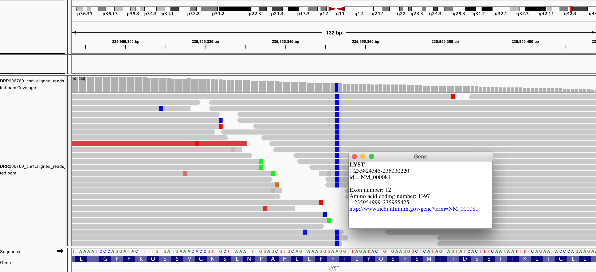

# 1. Background
## What exome analysis is?
Simply saying, based on genetic knowledge, find out causative variants from not so big data.  
It also requires some computational skills.

## What are required to exome analysis?
1. knowledge of genetics
1. knowledge of target diseases, especially for genetic background
1. knowledge of associated databases (how to find the information you want)
1. knowledge of exome sequencing/high speed sequencers/molecular biology
1. computational skills
1. knowledge of ethical problems/privacy protection/IF and SF

Although not absolute, it becomes more important in order from top to bottom.  
This is completely my biased list, so I can agree with 3 or 4 or 5 in reverse/change.


# 2. Aim
This mini-course is made for a lecture which let you get a first tiny step to bioinformatic analysis.  
It assumes that this is made for **step by step hands-on style, but this could be applied to self studying.  
Do not be afraid. If you failed something, nothing will happen. No sample lost. Not wasting any tips/chips/gels/solutions/enzymes/antibodies. Just gain your experiences. Practice makes perfect**:wink:

This course will cover:
- customise your macintosh environment for running bioinformatic programs
- experience simple target resequence data analysis
- understand what steps are there (alignment, remove duplicate, variant call..etc)
- how interpretate variants

Not cover:
- how algorithmn works
- how to handle massive amount data using cluster computers (SSH, Grid Job Scheduler, memory usage, disk I/O)
- deep/heuristic/complicated issues/knowledge/techniques/pitfalls (e.g. how can I sense abnormal data signs in heystacks)


# 3. Set up your mac :computer:
#### :point_right: Ideally, you should try and complete this section before hands-on
You have to set up your macintosh environment for informatic analyses.  
I know this is a first barricade to step in learning informatic skills, but this shold be done. I tried to make it as easy as possible.

## Minimal knowledge
- Terminal.app is a application to tell what you want to your computer via command lines
- `$ ` means command line in this page. $ is a prompt, so you don't need type $. Just type following characters
- `$ pwd` pwd means _**P**rint **W**orking **D**irectory_
- `$ cd` cd means _**C**hange **D**irectory_
- `$ mkdir new_diretory_name` mkdir means _**M**ake **D**irectory_
- `$ cat cnvkit.${platform}.summary.out C -f1,8 | perl -pe 's/\n/\t/; s/--/\n/; s/\nPt/Pt/' | perl -pe 's/^\tPt/Pt/' | cut -f4,6,8 | perl -F"\t" -lane 'next if $F[1] == 0 && $F[2] == 0; print join("\t", $F[0]/$F[1], $F[0])' S -k1,1g` _Don't be panic. No need to memorise today._ Just want to show you "|", Pipe. "|" connects two command. This is similar with pipetting twice, then centrifuge at 3,000 rpm, 10 min on ice...
- **Directory** means Folders in your launguage. In Linux/Unix world, it's directories
- GNU/Linux is a kind of OS (Operation Systems). Same as Windows and macOS. Most of servers are Linux
- Server is a computer, but not for personal use. Expensive/Cheap/High speed/Slow/Big/Small/Mail/Web...too diverse to express
- Linux is a open source copy of UNIX (not exactly)
- macOS is a kind of FreeBSD OS. BSD is a kind of UNIX https://en.wikipedia.org/wiki/Unix-like#/media/File:Unix_history-simple.svg
- UNIX is a OS developed by AT&T and MIT. It has several good features https://www.gotothings.com/unix/unix-features-and-advantages.htm
- Therefore, we frequently recomment to use Mac when you start to use command lines
- Google is your best friend :+1:
- may add later (frequently asked words or something)

## Make and move to your working directory
`$ cd ~/` go to your home directory (e.g. /Users/okazaki, /Users/kohda)  
`$ mkdir ~/exome_analysis` make directory named as exome_analysis under your home directory  
`$ cd ~/exome_analysis` move to ~/exome_analysis and use it as our basecamp directory  

## Install java (Java SE Development Kit 8u181 version)
Java is a kind of programming launguage.  
You need Java itself to run applications developed using Java launguage. For example, IGV, Picard and GATK are Java application.

Download Java SE Development Kit 8u181 from here  
https://www.oracle.com/technetwork/java/javase/downloads/jdk8-downloads-2133151.html  
Then, install on your mac.

After installation, confirm it by following procedures.  
Open Terminal.app (is located on /Application/Utilities), then type this shell command  
`$ java -version`

If succeeded, you will get following response

    java version "1.8.0_181"
    Java(TM) SE Runtime Environment (build 1.8.0_181-b13)
    Java HotSpot(TM) 64-Bit Server VM (build 25.181-b13, mixed mode)

## Install homebrew, a nice packge manager for macOS:beer:
A package manager maintains softwares (packages), such as install, update, and remove.  
Of course, you can manage your computer, but we usually use a package manager to make it easier.  
Go to this page, https://brew.sh/ then, follow the install instruction.

Open Terminal.app (is located on /Application/Utilities), then type this shell command  
`$ /usr/bin/ruby -e "$(curl -fsSL https://raw.githubusercontent.com/Homebrew/install/master/install)"`  
_The administrator password will be required in this process_

**In the process, you might be asked "Xcode command line tool installation" by computer. Please permit it. Xcode is a programming environment for macOS. It mainly used by software developer, but it also contains some necessary parts for running command line tools.**  

If succeeded, you will get following response

    ==> Next steps:
    - Run `brew help` to get started
    - Further documentation:
        https://docs.brew.sh

## Let's try to install new command (program, software, or package)
Wget command is a nice download utility for Web.  
`$ brew install wget`  
Try to download something.  
`$ wget https://www.dropbox.com/s/smuyzxmllmoctz1/test_variant_data_01.tsv`  
You can see the contents by this way  
`$ cat test_variant_data_01.tsv`  
Or  
`$ more test_variant_data_01.tsv`  
Or  
`$ less test_variant_data_01.tsv`  
_Push Q key for quit_

more/less is a viewer. Originally, there is more. Then, less was developped.

cat command means con**cat**enate. Concatenate multiple file, like this  
`$ cat fileA fileB`  
Let's test.
```
$ wget https://www.dropbox.com/s/5yfaiolgoi3cp3u/test_variant_data_02.tsv
$ cat test_variant_data_01.tsv test_variant_data_02.tsv
```
To make it easier to see,
```
$ cat test_variant_data_01.tsv test_variant_data_02.tsv > test_variant_data.concatenated.tsv 
$ less -S test_variant_data.concatenated.tsv
```
_Push Q key for quit_  

-S is a option of less command. It change less behavior to chop-long-lines.  
Commands have their specific options. You can see like this.  
```
$ less --help
$ cat --help
```

## Install softwares required for sequence analysis#1
At first, type this, to tell homebrew much more scientific programs  
`$ brew tap brewsci/bio`

### Install bwa < 3min
bwa for aligning reads to the reference genome (version 0.7.17)  
Burrows-Wheeler Aligner http://bio-bwa.sourceforge.net/  
Manual Reference Pages  - bwa (1) http://bio-bwa.sourceforge.net/bwa.shtml  
```
$ brew search bwa
$ brew info bwa #_see software detail information_  
$ brew install bwa
```

Type to check the installation  
`$ bwa`  

If installation succeeded, you will get following response  

    Program: bwa (alignment via Burrows-Wheeler transformation)
    Version: 0.7.17-r1188
    Contact: Heng Li <lh3@sanger.ac.uk>
    ...

### Install samtools < 3min
SAMtools for manipulating next-generation sequencing data (version 1.9)  
```
$ brew search samtools
$ brew info samtools
$ brew install samtools
```

Type to check the installation  
`$ samtools --version`

If installation succeeded, you will get following response

    samtools 1.9
    Using htslib 1.9
    Copyright (C) 2018 Genome Research Ltd.  

### Install IGV < 3min
Integrative Genomics Viewer is a viewer for NGS/Microarray data, developed by Broad Institute.  
Go to https://software.broadinstitute.org/software/igv/download and click 'Download and unzip the Binary Distribution archive'  
Then, double click downloaded item to expand. you will find IGV_2.4.13 directory.  
Or  
```
$ wget http://data.broadinstitute.org/igv/projects/downloads/2.4/IGV_Win_2.4.13.zip
$ unzip IGV_2.4.13.zip
```

To start up IGV, type  
`$ sh IGV_2.4.13/igv.sh`  
Java language will run IGV program. We will use IGV after sequece data alignment.

You also need to download the specific version of reference human genome (Human 1kg, b37 + decoy), it can be found in Menu bar "Genomes > Load Genome From Server"  

#### Tips: 1kg? b37?? decoy???
- 1kg means 1000 genomes project http://www.internationalgenome.org/  
- b37 is a version of human genome (build 37), which is provided by Genome Reference Consortium https://www.ncbi.nlm.nih.gov/grc  
- The decoy genome, starting point is here http://www.cureffi.org/2013/02/01/the-decoy-genome/

# 4. First step
Let make your first step. Certainly, this is really small. But, it may become a giant step in the future.  
Prepare (download!) sequence data,reference genome and related files, see the raw data (fastq), align fastq to the reference human genome, see the result using IGV.

## First analysis < 20 min
In this section, we will analyze following public data. 
This is very first step, so we just do align and see it using viewer.

Followings are summary of data we will use in this section.  
- Title: Identification of autosomal recessive spastic paraplegia with cerebellar ataxia and neuropathy
- Abstract: Objective: To identify the gene mutation responsible for a family presenting spastic paraplegia, cerebellar ataxia and neuropathy with autosomal recessive transmission. Background: Autosomal recessive hereditary spastic paraplegias (AR-HSP) constitute a heterogeneous group of neurodegenerative diseases involving pyramidal tracts dysfunction. The genes responsible for many types of AR-HSPs remain unknown.
- Methods: The present study included two patients in a Japanese consanguineous family. Their onset of symptoms was 48 and 58 years of age. Neurologic examination and DNA analysis were underwent in two patients and two normal family members. We performed a genomewide linkage analysis employing SNP arrays with two patients’ DNAs and exome sequencing using one patient’s sample.
- Results: **We identified a homozygous missense mutation in the lysosomal trafficking regulator (LYST) gene**
- DRA: http://ddbj.nig.ac.jp/DRASearch/study?acc=DRP000999
- **Causative gene: LYST c.4189T>G, p.F1397V**
- Paper: Autosomal-recessive complicated spastic paraplegia with a novel lysosomal trafficking regulator gene mutation. - PubMed - NCBI https://www.ncbi.nlm.nih.gov/pubmed/24521565

Firstly, download demo data and reference genome sequence files.  
I prepared small data which aquired from public sequence database. It's already modified to contain chromosome 1 reads. File size are 54M and 55M.  
```
$ wget -c https://www.dropbox.com/s/eg8k4xmmw23nfnq/DRR006760_chr1_1.fastq.gz
$ wget -c https://www.dropbox.com/s/b4awju0mkt8q3bn/DRR006760_chr1_2.fastq.gz
```

You also need reference genome sequence files. Totally, 8.1G will be downloaded (< 10 min).  
```
$ wget -c https://www.dropbox.com/s/9qmtqwgq8pxyj99/human_g1k_v37_decoy.fasta
$ wget -c https://www.dropbox.com/s/9dpu7ver996c8m0/human_g1k_v37_decoy.fasta.amb
$ wget -c https://www.dropbox.com/s/b3rmp79xgixiyk5/human_g1k_v37_decoy.fasta.ann
$ wget -c https://www.dropbox.com/s/oplswegvl68fd96/human_g1k_v37_decoy.fasta.bwt
$ wget -c https://www.dropbox.com/s/4lgsboui7l01mq1/human_g1k_v37_decoy.fasta.fai
$ wget -c https://www.dropbox.com/s/6dkq2f6dokddyqs/human_g1k_v37_decoy.fasta.pac
$ wget -c https://www.dropbox.com/s/4braaqyewooqt4p/human_g1k_v37_decoy.fasta.sa
$ wget -c https://www.dropbox.com/s/drit0y6xu6dnpg7/human_g1k_v37_decoy.dict
```

Secondary, align paired sequence reads to the 1000 genomes project-customised human reference genome build 37 (human_g1k_v37_decoy).  
```
$ bwa mem -t4 -M \
              -R "@RG\tID:FLOWCELLID\tSM:DRR006760_chr1\tPL:illumina\tLB:DRR006760_chr1_library_1" \
              human_g1k_v37_decoy.fasta \
              DRR006760_chr1_1.fastq.gz DRR006760_chr1_2.fastq.gz | \
              samtools view -@4 -1 - | samtools sort -@4 - -o - > DRR006760_chr1.aligned_reads_sorted.bam
```  

you will get following response. It will take about few min by my MacBookPro 2014 (2.2GHz).  

    [M::bwa_idx_load_from_disk] read 0 ALT contigs
    [M::process] read 396040 sequences (40000040 bp)...
    [M::process] read 396040 sequences (40000040 bp)...
    [M::mem_pestat] # candidate unique pairs for (FF, FR, RF, RR): (0, 142256, 0, 0)
    ...snip

Then, make Index file for aligned sequence file (.bam file). It takes few seconds.  
`$ samtools index -@ 4 DRR006760_chr1.aligned_reads_sorted.bam`  

Thirdly, see this aligned sequence reads,  
`$ sh IGV_2.4.13/igv.sh DRR006760_chr1.aligned_reads_sorted.bam`  
Go to 1:235,955,287-235,955,418 to see the mutation.

Can you see? Genomic position of this screenshot is 1:235955298-235955423 (build 37).



# Second step
More similar with real one.  
Using same fastq, but add Quality Check, Trimming, data cleaning for variant call, variant call, annotate variants, interpretation.  
And one more, how to estimate propar threshold for MAF (Minor Allele Frequency) for specific disease.  

## Install softwares required for sequence analysis#2

### Install GNU grep < 3min
grep is a command-line utility for searching plain-text data sets for lines.  
GNU version is faster than BSD grep.
`$ brew install grep --with-default-names`

Type to check the installation  
`$ grep --version`

If installation succeeded, you will get

    grep (GNU grep) 3.1
    Packaged by Homebrew
    Copyright (C) 2017 Free Software Foundation, Inc.

### Install Tableview < 3min
Format CSV file as human readable table  https://github.com/informationsea/tableview
```
$ wget https://github.com/informationsea/tableview/releases/download/v0.4.6/tableview_darwin_amd64
$ chmod +x ./tableview_darwin_amd64
```

Type to check the installation  
`./tableview_darwin_amd64 -version`

If installation succeeded, you will get

    tableview : human friendly table viewer
    Version: v0.4.6(f7310cc7b05b43b7e8f5f9df9c09182bd98bd7f7)

### brew install fastqc

### Install Trimmomatic < 3min
Trimmomatic is a trimming tool for Illumina NGS data

USADELLAB.org - Trimmomatic: A flexible read trimming tool for Illumina NGS data http://www.usadellab.org/cms/?page=trimmomatic

```
$ wget -c http://www.usadellab.org/cms/uploads/supplementary/Trimmomatic/Trimmomatic-0.38.zip
$ unzip Trimmomatic-0.38.zip
```

Type to check the installation  
`$ java -jar Trimmomatic-0.38/trimmomatic-0.38.jar`

If installation succeeded, you will get

    Usage:
    PE [-version] [-threads <threads>] [-phred33|-phred64] [-trimlog <trimLogFile>] [-summary <statsSummaryFile>] [-quiet] [-validatePairs] [-basein <inputBase> | <inputFile1> <inputFile2>] [-baseout <outputBase> | <outputFile1P> <outputFile1U> <outputFile2P> <outputFile2U>] <trimmer1>...
    ...

### Install Picard < 3min
Similar with SAMtools, Picard is a multi-purpose program for NGS analyses.  
Picard Tools - By Broad Institute https://broadinstitute.github.io/picard/  
Currently, Picard has 86 tools   

```
$ brew search picard
$ brew info picard-tools
$ brew install picard-tools
```

Type to check the installation  
`$ picard SortSam -h`

If installation succeeded, you will get

    USAGE: SortSam [options]
    Documentation: http://broadinstitute.github.io/picard/command-line-overview.html#SortSam
    This tool sorts the input SAM or BAM file by coordinate, queryname (QNAME), or some other property of the SAM record.
    ...

This is the reason that you frequently saw the screenshot of StarTrek in presentations for NGS analysis  


### Install GATK < 3min
GATK (**G**enome **A**nalysis **T**ool**k**it) is a tool for variant discovery in high-throughput sequencing data.  
GATK | Home https://software.broadinstitute.org/gatk/
Newest version is 4.0.6. But, we use version 3.8.1 in this hands-on. If you became familier with command lines, I strongly recommend to upgrade to latest version.  

```
$ wget https://software.broadinstitute.org/gatk/download/auth\?package\=GATK-archive\&version\=3.8-1-0-gf15c1c3ef -O GATK-3.8-1-0-gf15c1c3ef.tar.gz
$ tar zxvf GATK-3.8-1-0-gf15c1c3ef.tar.gz
```
Type to check the installation  
`$ java -jar GenomeAnalysisTK-3.8-1-0-gf15c1c3ef/GenomeAnalysisTK.jar --version`

If installation succeeded, you will get

    3.8-1-0-gf15c1c3ef

### Install GATK bundle resource 10min
Resouce bundle is a collection of standard files for working with human resequencing data with the GATK.  
Go to resource bundle page https://software.broadinstitute.org/gatk/download/bundle  
Read "FTP Server Access" section, and go to ftp site. Dive to b37 directory.  
There are 70 files :astonished:  
Luckly, we only need two files in this course :laughing:  
- dbsnp_138.b37.vcf
- Mills_and_1000G_gold_standard.indels.b37.vcf

Download following files, and expand them.
- Mills_and_1000G_gold_standard.indels.b37.vcf.gz
- Mills_and_1000G_gold_standard.indels.b37.vcf.gz.md5
- Mills_and_1000G_gold_standard.indels.b37.vcf.idx.gz
- Mills_and_1000G_gold_standard.indels.b37.vcf.idx.gz.md5
- dbsnp_138.b37.vcf.gz
- dbsnp_138.b37.vcf.gz.md5
- dbsnp_138.b37.vcf.idx.gz
- dbsnp_138.b37.vcf.idx.gz.md5
Totally, 1.4G. It takes about 10 mins.


More detail information of resource bundle https://software.broadinstitute.org/gatk/documentation/article.php?id=11017

I know you are tired for downloading. I'm too.  
Most part of molecular work are occupied by pipetting, most part of bioinformatic work are occupied by preparing and data cleaning. Please calm down :sob:  

Before staring analysis, check your directory and files.  
`$ pwd`  
Are you in the working directory (exome_analysis)? If not, change directory by type this command  
`$ cd ~/exome_analysis`  
Then, check files. Are you ready?  
`$ ls -vlhrt`  
ここにファイルを書く

## Let's step forward

FASTQ format - Wikipedia https://en.wikipedia.org/wiki/FASTQ_format

ここに手順の概略を

```
$ id=DRR006760_chr1
$ echo ${id}
```

### Fastq trimming <1 min
```
$ java -Xmx4g -jar Trimmomatic-0.38//Trimmomatic-0.38.jar PE \
                 -threads 4 -phred33 -trimlog ${id}.trimlog \
                 ${id}_1.fastq.gz \
                 ${id}_2.fastq.gz \
                 ${id}_1.paired.fastq.gz ${id}_1.unpaired.fastq.gz \
                 ${id}_2.paired.fastq.gz ${id}_2.unpaired.fastq.gz \
                 TRAILING:20 MINLEN:50
```

You will get following respond

    TrimmomaticPE: Started with arguments:
     -threads 4 -phred33 -trimlog DRR006760_chr1.trimlog DRR006760_chr1_1.fastq.gz DRR006760_chr1_2.fastq.gz DRR006760_chr1_1.paired.fastq.gz DRR006760_chr1_1.unpaired.fastq.gz DRR006760_chr1_2.paired.fastq.gz DRR006760_chr1_2.unpaired.fastq.gz TRAILING:20 MINLEN:50
    Input Read Pairs: 1058370 Both Surviving: 1041699 (98.42%) Forward Only Surviving: 10118 (0.96%) Reverse Only Surviving: 6029 (0.57%) Dropped: 524 (0.05%)
    TrimmomaticPE: Completed successfull

Check file size of all fastq.gz  
`$ ls -hl ${id}*fastq.gz`

## Mapping sequence reads to the reference genome <1 min
```
$ bwa mem -t4 -M \
            -R "@RG\tID:FLOWCELLID\tSM:${id}\tPL:illumina\tLB:${id}_library_1" \
            human_g1k_v37_decoy.fasta \
            ${id}_1.paired.fastq.gz ${id}_2.paired.fastq.gz -o ${id}.aligned_reads.sam

$ samtools view -@4 -1 ${id}.aligned_reads.sam > ${id}.aligned_reads.bam
$ samtools sort -@4 -m 2G ${id}.aligned_reads.bam -o ${id}.aligned_reads_sorted.bam
$ samtools index ${id}.aligned_reads_sorted.bam
```

echo "bwa bam サイズ確認"
$ ls -hl ${id}.aligned_reads.bam ${id}.aligned_reads_sorted.bam


echo "MarkDuplicates <1min."

$ picard MarkDuplicates \
       INPUT=${id}.aligned_reads_sorted.bam \
       OUTPUT=${id}.aligned_reads_dedup_sorted.bam \
       METRICS_FILE=${id}.duplicate.metrics \
       VALIDATION_STRINGENCY=LENIENT \
       ASSUME_SORTED=true REMOVE_DUPLICATES=true

ILLUMINACLIP: Cut adapter and other illumina-specific sequences from the read.
SLIDINGWINDOW: Perform a sliding window trimming, cutting once the average quality within the window falls below a threshold.
LEADING: Cut bases off the start of a read, if below a threshold quality
TRAILING: Cut bases off the end of a read, if below a threshold quality
CROP: Cut the read to a specified length
HEADCROP: Cut the specified number of bases from the start of the read
MINLEN: Drop the read if it is below a specified length
TOPHRED33: Convert quality scores to Phred-33
TOPHRED64: Convert quality scores to Phred-64

$ samtools index ${id}.aligned_reads_dedup_sorted.bam

echo "picard bam サイズ確認2"
$ ls -hl ${id}.aligned_reads_sorted.bam
$ ls -hl ${id}.aligned_reads_dedup_sorted.bam


# Third step
Exam. In other words, homework. But, don't move data to your home!  
Solve our 200 cases, include many unknown cases. Patient ID are removed. No hint. Most of cases are easy. Some cases are quit difficult. I solved all the cases. Happy to see your excellent result :satisfied:

___

Under construction

## Tips: using memory, avoid using slow hard disk for speeding up
We did alignment using bwa program previously. As you can see, the bwa command was long, and included samtools command.  
This is done by "|". **Pipe**. "|" connects two command. In previous command, connected bwa and samtools. The result of bwa aligned data passed to samtools. This is very important. Why? If we used "|", we can use memory space instead of writing data to the very slow hard disk. Memory speed is extrem faster than hard disk.  
Let's experience (but, if you used small data, you can't feel it).  
```
$ bwa mem -t4 -M \
              -R "@RG\tID:FLOWCELLID\tSM:DRR006760_chr1\tPL:illumina\tLB:DRR006760_chr1_library_1" \
              human_g1k_v37_decoy.fasta \
              DRR006760_chr1_1.fastq.gz DRR006760_chr1_2.fastq.gz > DRR006760_chr1.aligned_reads.sam
$ samtools view -@4 -1 DRR006760_chr1.aligned_reads.sam -o DRR006760_chr1.aligned_reads.bam
$ samtools sort -@4  DRR006760_chr1.aligned_reads.bam -o DRR006760_chr1.aligned_reads_sorted.bam
```  


あと base_dir のことが必要
