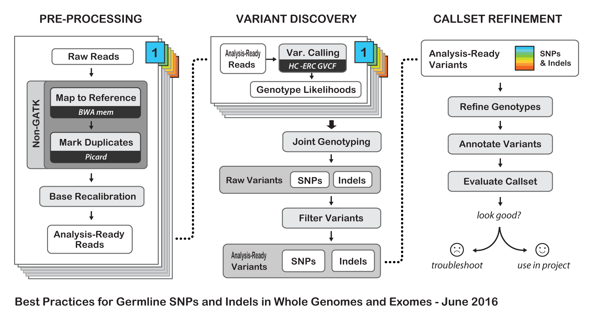
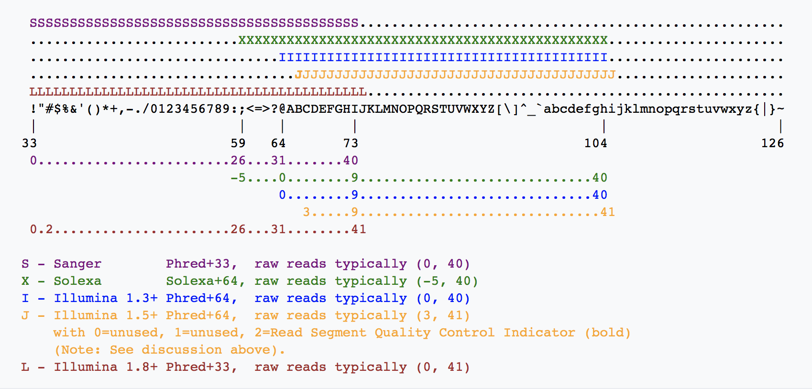
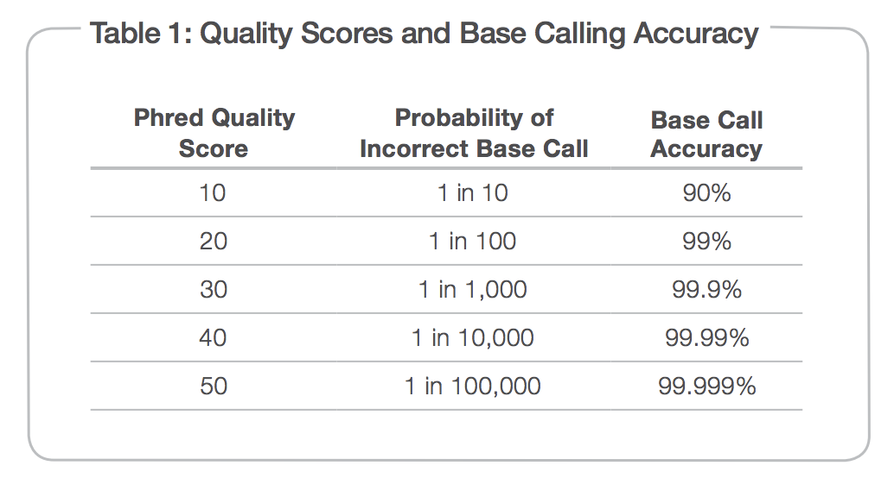
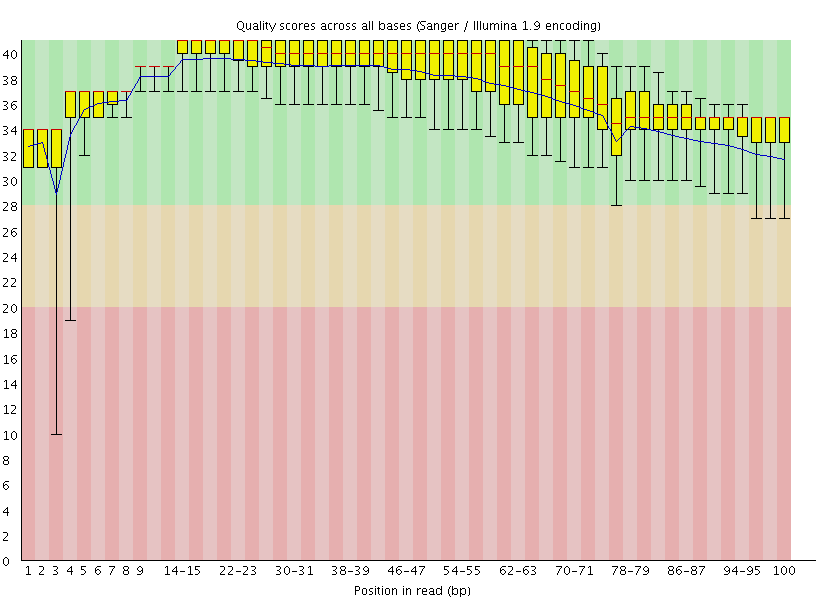
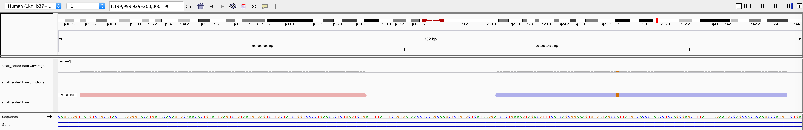
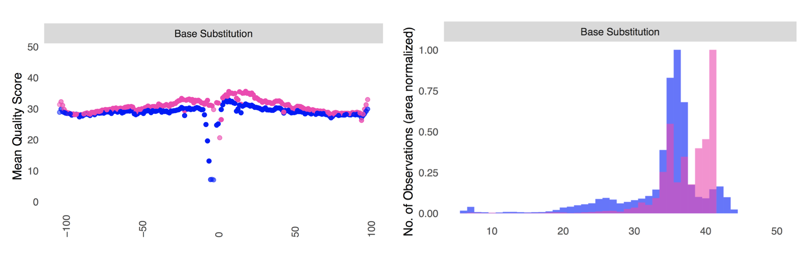
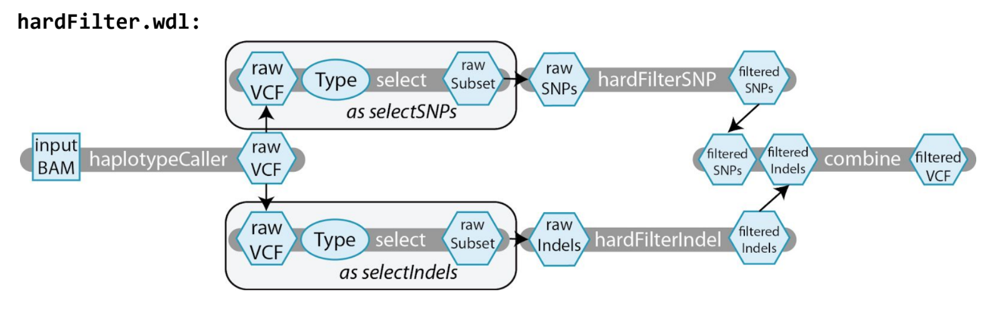
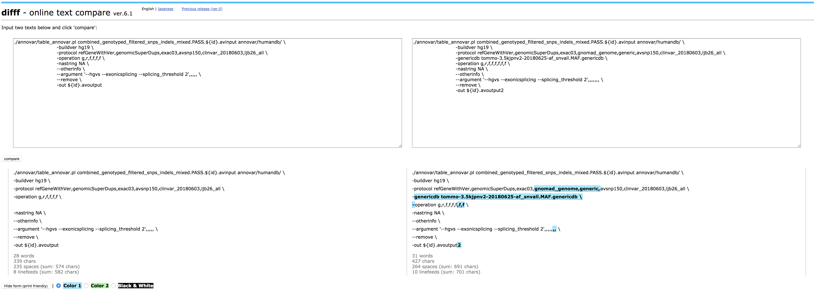

# 1. Background
## What exome analysis is?
Simply saying, based on genetic knowledge, find out causative variants from not so big data.  
It also requires some computational skills.

## What are required to exome analysis?
1. knowledge of genetics
1. knowledge of target diseases, especially for genetic background
1. knowledge of associated databases (how to find the information you want)
1. knowledge of exome sequencing/high speed sequencers/molecular biology
1. computational skills
1. knowledge of ethical problems/privacy protection/IF and SF

Although not absolute, it becomes more important in order from top to bottom.  
This is completely my biased list, so I can agree with 3 or 4 or 5 in reverse/change.


# 2. Aim
This mini-course is made for a lecture which let you get a first tiny step to bioinformatic analysis.  
It assumes that this is made for **step by step hands-on style, but this could be applied to self studying.  
Do not be afraid. If you failed something, nothing will happen. No sample lost. Not wasting any tips/chips/gels/solutions/enzymes/antibodies. Just gain your experiences. Practice makes perfect** :wink:

## This course will cover:
- customise your macintosh environment for running bioinformatic programs
- experience simple target resequence data analysis
- understand what steps are there (alignment, remove duplicate, variant call..etc)
- how interpretate variants

## Not cover:
- how algorithmn works
- how to handle massive amount data using cluster computers (SSH, Grid Job Scheduler, memory usage, disk I/O)
- deep/heuristic/complicated issues/knowledge/techniques/pitfalls (e.g. how can I sense abnormal data signs in heystacks)

## Prerequires

- recent macOS machine (you should know administrator password)
- you should try session 1-4 (From "Set up your mac" to "First step") by yourself
- you minimally have to complete to download several files as listed here
    - DRR006760_chr1_1.fastq.gz (See 4. First step > First analysis)
    - DRR006760_chr1_2.fastq.gz
    - human_g1k_v37_decoy.fasta (See 4. First step > First analysis)
    - human_g1k_v37_decoy.fasta.amb
    - human_g1k_v37_decoy.fasta.ann
    - human_g1k_v37_decoy.fasta.bwt
    - human_g1k_v37_decoy.fasta.fai
    - human_g1k_v37_decoy.fasta.pac
    - human_g1k_v37_decoy.fasta.sa
    - human_g1k_v37_decoy.dict
    - Mills_and_1000G_gold_standard.indels.b37.vcf.gz (See 5. Second step > Install GATK bundle resource)
    - Mills_and_1000G_gold_standard.indels.b37.vcf.idx.gz
    - dbsnp_138.b37.vcf.gz
    - dbsnp_138.b37.vcf.idx.gz

## Beyond this course
For further advanced self studies, you already know there are so many pages in the internet :astonished:  
I think these materials might be nice for the next step.  
- The Canadian Bioinformatics workshops (past workshop materials/videos are ready) https://bioinformatics.ca/workshops/
- 平成28年度NGSハンズオン講習会カリキュラム NBDC https://biosciencedbc.jp/human/human-resources/workshop/h28-2

# 3. Set up your mac :computer:
#### :point_right: Ideally, you should try and complete this section before hands-on
You have to set up your macintosh environment for informatic analyses.  
I know this is a first barricade to step in learning informatic skills, but this shold be done. I tried to make it as easy as possible.

## Minimal knowledge
- copy/paste shortcut keys in macOS: copy is Cmd + C, paste is Cmd + V
- Terminal.app is a application to tell what you want to your computer via command lines
- `$ ` means command line in this page. $ is a prompt, so you don't need type $. Just type following characters
- `$ pwd` pwd means _**P**rint **W**orking **D**irectory_
- **Directory** means Folders in your launguage. In Linux/Unix world, it's directories
- `$ cd` cd means _**C**hange **D**irectory_
- `$ mkdir new_diretory_name` mkdir means _**M**ake **D**irectory_
- GNU/Linux is a kind of OS (Operation Systems). Same as Windows and macOS. Most of servers are Linux
- Server is a computer, but not for personal use. Expensive/Cheap/High speed/Slow/Big/Small/Mail/Web...too diverse to express
- Linux is a open source copy of UNIX (not exactly)
- macOS is a kind of FreeBSD OS. BSD is a kind of UNIX https://en.wikipedia.org/wiki/Unix-like#/media/File:Unix_history-simple.svg
- UNIX is a OS developed by AT&T and MIT. It has several good features https://www.gotothings.com/unix/unix-features-and-advantages.htm
- Therefore, we frequently recomment to use Mac when you start to use command lines
- **Google is your best friend** :+1:
- may add later (frequently asked words or something)

## Make and move into your working directory
**This step is very important to avoid bad slippings.** 
`$ cd ~/` go to your home directory (e.g. /Users/okazaki or /Users/kohda in macOS, /home/borna or /home/chern in Linux)  
`$ mkdir ~/exome_analysis` make directory named as exome_analysis under your home directory  
`$ cd ~/exome_analysis` move to ~/exome_analysis and use it as our basecamp directory  
All data should be gathered here.

## Install java (Java SE Development Kit 8u181 version)
Java is a kind of programming launguage.  
You need Java itself to run applications developed using Java launguage. For example, IGV, Picard and GATK are Java application. We will install them.

Download Java SE Development Kit 8u181 from here  
https://www.oracle.com/technetwork/java/javase/downloads/jdk8-downloads-2133151.html  
Then, install on your mac.

After installation, confirm it by following procedures.  
Open Terminal.app (is located on /Application/Utilities), then type this shell command  
`$ java -version`

If succeeded, you will get following response

    java version "1.8.0_181"
    Java(TM) SE Runtime Environment (build 1.8.0_181-b13)
    Java HotSpot(TM) 64-Bit Server VM (build 25.181-b13, mixed mode)

## Install homebrew, a nice packge manager for macOS :beer:
A package manager maintains softwares (packages), such as install, update, and remove.  
Of course, you can manage your computer, but we usually use a package manager to make it easier.  
Go to this page, https://brew.sh/ then, follow the install instruction.

Open Terminal.app (is located on /Application/Utilities), then type this shell command  
`$ /usr/bin/ruby -e "$(curl -fsSL https://raw.githubusercontent.com/Homebrew/install/master/install)"`  
_The administrator password will be required in this process_
curl is a command line tool for getting or sending files using URL syntax. Here, curl downloads homebrew install script from github, then Ruby runs the install script to install homebrew into your macOS system.

**In the process, you might be asked "Xcode command line tool installation" by computer. Please permit it. Xcode is a programming environment for macOS. It mainly used by software developer, but it also contains some necessary parts for running command line tools.**  

If succeeded, you will get following response

    ==> Next steps:
    - Run `brew help` to get started
    - Further documentation:
        https://docs.brew.sh

## Let's try to install new command (program, software, or package)
Wget command is a nice download utility for Web.  
`$ brew install wget`  
Try to download something.  
`$ wget https://www.dropbox.com/s/smuyzxmllmoctz1/test_variant_data_01.tsv`  
You can see the contents by this way  
`$ cat test_variant_data_01.tsv`  
Or  
`$ more test_variant_data_01.tsv`  
Or  
`$ less test_variant_data_01.tsv`  
_Push Q key for quit_

more/less is a viewer. Originally, there is more. Then, less was developped.

cat command means con**cat**enate. Concatenate multiple file, like this  
`$ cat fileA fileB`  
Let's test.
```
$ wget https://www.dropbox.com/s/5yfaiolgoi3cp3u/test_variant_data_02.tsv
$ cat test_variant_data_01.tsv test_variant_data_02.tsv
```
To make it easier to see,
```
$ cat test_variant_data_01.tsv test_variant_data_02.tsv > test_variant_data.concatenated.tsv 
$ less -S test_variant_data.concatenated.tsv
```
_Push Q key for quit_  

">" is a kind of shell function. Here, ">" works for redirecting command output to the specific file. We call this function as "redict".  
-S is a option of less command. It change less behavior to chop-long-lines.  
Commands have their specific options. You can see like this.  
```
$ less --help
$ cat --help
```

## Install softwares required for sequence analysis#1
At first, type this, to tell homebrew much more scientific programs  
`$ brew tap brewsci/bio`

### Install bwa (< 3 min)
bwa for aligning reads to the reference genome (version 0.7.17)  
- Burrows-Wheeler Aligner http://bio-bwa.sourceforge.net/  
- Manual Reference Pages  - bwa (1) http://bio-bwa.sourceforge.net/bwa.shtml  

```
$ brew search bwa
$ brew info bwa #_see software detail information_  
$ brew install bwa
```

Type to check the installation  
`$ bwa`  

If succeeded, you will get following response  

    Program: bwa (alignment via Burrows-Wheeler transformation)
    Version: 0.7.17-r1188
    Contact: Heng Li <lh3@sanger.ac.uk>
    ...

### Install samtools (< 3 min)
SAMtools for manipulating next-generation sequencing data (version 1.9)  
```
$ brew search samtools
$ brew info samtools
$ brew install samtools
```

Type to check the installation  
`$ samtools --version`

If succeeded, you will get following response

    samtools 1.9
    Using htslib 1.9
    Copyright (C) 2018 Genome Research Ltd.  

### Install IGV (< 3 min)
Integrative Genomics Viewer is a viewer for NGS/Microarray data, developed by Broad Institute.  
Go to https://software.broadinstitute.org/software/igv/download and click 'Download and unzip the Binary Distribution archive'  
Then, double click downloaded item to expand. you will find IGV_2.4.13 directory.  
Or  
```
$ wget http://data.broadinstitute.org/igv/projects/downloads/2.4/IGV_2.4.13.zip
$ unzip IGV_2.4.13.zip
```
Make sure directories. Now, I expect "~/exome_analysis/IGV_2.4.13".  
Can you see following results by this command?  
`$ ls -vlht ~/exome_analysis/IGV_2.4.13`

    total 69760
    -rw-r--r--@ 1 mako  staff    30M  7 12 03:30 igv.jar
    -rw-r--r--@ 1 mako  staff   1.6M  7 12 03:30 log4j-core-2.11.0.jar
    -rw-r--r--@ 1 mako  staff   119K  7 12 03:30 batik-codec-1.10.jar
    -rw-r--r--@ 1 mako  staff   1.9M  7 12 03:30 goby-io-igv-1.1.jar
    -rw-r--r--@ 1 mako  staff   253B  7 12 03:30 igv.bat
    -rwxr-xr-x@ 1 mako  staff   639B  7 12 03:30 igv.command
    -rwxr-xr-x@ 1 mako  staff   436B  7 12 03:30 igv.sh

To start up IGV, type  
`$ sh IGV_2.4.13/igv.sh -g 1kg_v37`  
Java language will run IGV program. We will use IGV after sequece data alignment.
1kg_v37 specify the human genome version. If this is the first time IGV wake up, it will start downloading automatically.  
You can download the specific version of reference human genome (Human 1kg, b37 + decoy), it can be found in Menu bar "Genomes > Load Genome From Server"  

### Tips: 1kg? b37?? decoy???
- 1kg means 1000 genomes project http://www.internationalgenome.org/  
- b37 is a version of human genome (build 37), which is provided by Genome Reference Consortium https://www.ncbi.nlm.nih.gov/grc  
- decoy is a sequence derived from HuRef, human BAC and Fosmid clones, and NA12878.
  - Scientific Notes/human genome - DNAnexus Wiki https://wiki.dnanexus.com/scientific-notes/human-genome
  - hs37d5.slides.pdfftp://ftp.1000genomes.ebi.ac.uk/vol1/ftp/technical/reference/phase2_reference_assembly_sequence/hs37d5.slides.pdf


# 4. First step
Let make your first step. Certainly, this is really small. But, it may become a giant step in the future.  

## First analysis (< 20 min)
In this section, we will analyze following public data. 
We just prepare (**download by yourself!**) sequence reads, reference genome and related files. Then, align reads (fastq) to the reference human genome using BWA, see the result using IGV.

Followings are summary of data we will use in this section.  
- Title: Identification of autosomal recessive spastic paraplegia with cerebellar ataxia and neuropathy
- Objective: To identify the gene mutation responsible for a family presenting spastic paraplegia, cerebellar ataxia and neuropathy with autosomal recessive transmission.
- Methods: The present study included two patients in a Japanese consanguineous family. Their onset of symptoms was 48 and 58 years of age. Neurologic examination and DNA analysis were underwent in two patients and two normal family members. We performed a genomewide linkage analysis employing SNP arrays with two patients’ DNAs and **exome sequencing using one patient’s sample.**
- Results: **We identified a homozygous missense mutation in the lysosomal trafficking regulator (LYST) gene**
- DRA: http://ddbj.nig.ac.jp/DRASearch/study?acc=DRP000999
- **Causative gene: LYST c.4189T>G, p.F1397V**
- Paper: Autosomal-recessive complicated spastic paraplegia with a novel lysosomal trafficking regulator gene mutation. - PubMed - NCBI https://www.ncbi.nlm.nih.gov/pubmed/24521565

Firstly, download demo data and reference genome sequence files.  
I made small data which aquired from public sequence database. It's already modified to contain chromosome 1 reads only. File size are 54M and 55M (original sizes are 4.8G and 4.9G).  
```
$ wget -c https://www.dropbox.com/s/eg8k4xmmw23nfnq/DRR006760_chr1_1.fastq.gz
$ wget -c https://www.dropbox.com/s/b4awju0mkt8q3bn/DRR006760_chr1_2.fastq.gz
```

You also need reference genome sequence files. Totally, 8.1G will be downloaded (< 10 min).  
```
$ wget -c https://www.dropbox.com/s/9qmtqwgq8pxyj99/human_g1k_v37_decoy.fasta
$ wget -c https://www.dropbox.com/s/9dpu7ver996c8m0/human_g1k_v37_decoy.fasta.amb
$ wget -c https://www.dropbox.com/s/b3rmp79xgixiyk5/human_g1k_v37_decoy.fasta.ann
$ wget -c https://www.dropbox.com/s/oplswegvl68fd96/human_g1k_v37_decoy.fasta.bwt
$ wget -c https://www.dropbox.com/s/4lgsboui7l01mq1/human_g1k_v37_decoy.fasta.fai
$ wget -c https://www.dropbox.com/s/6dkq2f6dokddyqs/human_g1k_v37_decoy.fasta.pac
$ wget -c https://www.dropbox.com/s/4braaqyewooqt4p/human_g1k_v37_decoy.fasta.sa
$ wget -c https://www.dropbox.com/s/drit0y6xu6dnpg7/human_g1k_v37_decoy.dict
```

Secondary, align paired sequence reads to the 1000 genomes project-customised human reference genome build 37 (human_g1k_v37_decoy).  
```
$ bwa mem -t4 -M \
              -R "@RG\tID:FLOWCELLID\tSM:DRR006760_chr1\tPL:illumina\tLB:DRR006760_chr1_library_1" \
              human_g1k_v37_decoy.fasta \
              DRR006760_chr1_1.fastq.gz DRR006760_chr1_2.fastq.gz > DRR006760_chr1.aligned_reads.sam
```
Backslash "\", this is a special character which could supresses RETURN character.  
We use "\" for separating single command line to multi lines for easy viewing.  
">" is a kind of shell function. Here, ">" works for redirecting command output to the specific file.

You will get following response. BWA MEM alignment will take about few min by my MacBookPro 2014 (2.2GHz).  

    [M::bwa_idx_load_from_disk] read 0 ALT contigs
    [M::process] read 396040 sequences (40000040 bp)...
    [M::process] read 396040 sequences (40000040 bp)...
    [M::mem_pestat] # candidate unique pairs for (FF, FR, RF, RR): (0, 142256, 0, 0)
    ...snip
    [M::mem_process_seqs] Processed 136540 reads in 17.513 CPU sec, 4.203 real sec
    [main] Version: 0.7.17-r1188
    [main] CMD: bwa mem -t4 -M -R @RG\tID:FLOWCELLID\tSM:DRR006760_chr1\tPL:illumina\tLB:DRR006760_chr1_library_1 human_g1k_v37_decoy.fasta DRR006760_chr1_1.fastq.gz DRR006760_chr1_2.fastq.gz
    [main] Real time: 73.078 sec; CPU: 257.598 sec

sam (Sequence Alignment Map) format is a text based format that stores alignment data.  

sam file is a kind of plain text format. So, you can see using less command like this.  
`$ less -S DRR006760_chr1.aligned_reads.sam`  
_Push Q key for quit_

Minimally, you can know about sam format in Wikipedia.  
SAM (file format) - Wikipedia https://en.wikipedia.org/wiki/SAM_(file_format)  
Explain SAM Flags https://broadinstitute.github.io/picard/explain-flags.html

Convert .sam file to .bam format.  
bam (Binary Alignment Map) format is the binary version of sam.  
`$ samtools view -@4 -1 DRR006760_chr1.aligned_reads.sam > DRR006760_chr1.aligned_reads.bam`  
Sort .bam contents.  
`$ samtools sort -@4 DRR006760_chr1.aligned_reads.bam -o DRR006760_chr1.aligned_reads_sorted.bam`  
If succeeded, you will get following response (but, some people get no response that is other normal behavior. So, no problem .I'm not sure what makes this difference. Machine dependent?)

    [bam_sort_core] merging from 0 files and 4 in-memory blocks...

Make .bam index file to make search.  
`$ samtools index DRR006760_chr1.aligned_reads_sorted.bam`  
If succeeded, you will get no response here. Some of commands give us no response when they succeeded. It's linux culture (no response means no warn/error). Adjust you to this.

You can see helpful messages like this.  
```
$ samtools
$ samtools sort
$ samtools index
```

Check generated files.  
`$ ls -vlhrt DRR006760*`

You will see like this.

    -rw-r--r-- 1 mako  55M  7 20 22:09 DRR006760_chr1_2.fastq.gz
    -rw-r--r-- 1 mako  54M  7 20 22:09 DRR006760_chr1_1.fastq.gz
    -rw-r--r-- 1 mako 660M  7 25 13:08 DRR006760_chr1.aligned_reads.sam
    -rw-r--r-- 1 mako 158M  7 25 13:54 DRR006760_chr1.aligned_reads.bam
    -rw-r--r-- 1 mako 141M  7 25 13:54 DRR006760_chr1.aligned_reads_sorted.bam
    -rw-r--r-- 1 mako 1.5M  7 25 13:54 DRR006760_chr1.aligned_reads_sorted.bam.bai

.sam file is huge, because it is not compressed.

Thirdly, see this aligned sequence reads,  
`$ sh IGV_2.4.13/igv.sh -g 1kg_v37 DRR006760_chr1.aligned_reads_sorted.bam`  

Confirm your selected genome is "Human (1kg, b37+decoy)".  
Go to 1:235955253-235955453 to see the mutation.

Can you find this? Genomic position of LYST:c.4189T>G:p.F1397V is 1:235955353 (build 37). ***#Fixed: 180807***


# 5. Second step (< 2 days; depend on you)
More similar with real analysis.  
Using same fastq, but add quality check, trimming, data cleaning for variant call, variant call, annotate variants, interpretation steps.  

**And one more, how to estimate propar threshold for MAF (Minor Allele Frequency) for specific disease. (still progress)**

**Making a tiny shell script for automatic proccessing. (still progress)**

**加筆するかも**

## Workflow of today
This picture shows you the flowchart of today. We add fastq quality check and trimming to this.  

https://software.broadinstitute.org/gatk/documentation/article.php?id=7870

## Install softwares required for sequence analysis#2

### Install GNU grep (< 3 min)
grep is a command-line utility for searching plain-text data sets for lines.  
GNU version is faster than BSD grep.  
`$ brew install grep --with-default-names`

Type to check the installation  
`$ grep --version`

If succeeded, you will get following response

    grep (GNU grep) 3.1
    Packaged by Homebrew
    Copyright (C) 2017 Free Software Foundation, Inc.

### Install GNU version utilities (< 3 min)
Coreutils includes GNU version of some commands. Such as md5sum, ls, and more than 100 commands.  
`$ brew install coreutils`  
Unfortunately, there is slight different command behaviors between macOS (FreeBSD) version and GNU Linux version. We will use some GNU version commands.

### Install Tableview (< 3 min)
Format CSV file as human readable table  https://github.com/informationsea/tableview
```
$ wget https://github.com/informationsea/tableview/releases/download/v0.4.6/tableview_darwin_amd64
$ chmod +x ./tableview_darwin_amd64
```

Type to check the installation  
`$ ./tableview_darwin_amd64 -version`

If succeeded, you will get following response

    tableview : human friendly table viewer
    Version: v0.4.6(f7310cc7b05b43b7e8f5f9df9c09182bd98bd7f7)

### brew install fastqc
FastQC is a quality control tool for high throughput sequence data.  
`$ brew install fastqc`

Type to check the installation  
`$ fastqc --version`

If succeeded, you will get following response

    FastQC v0.11.7

### Install Trimmomatic (< 3 min)
Trimmomatic is a trimming tool for Illumina NGS data.

USADELLAB.org - Trimmomatic: A flexible read trimming tool for Illumina NGS data http://www.usadellab.org/cms/?page=trimmomatic

```
$ wget -c http://www.usadellab.org/cms/uploads/supplementary/Trimmomatic/Trimmomatic-0.38.zip
$ unzip Trimmomatic-0.38.zip
```

Type to check the installation  
`$ java -jar Trimmomatic-0.38/trimmomatic-0.38.jar`

If succeeded, you will get following response

    Usage:
    PE [-version] [-threads <threads>] [-phred33|-phred64] [-trimlog <trimLogFile>] [-summary <statsSummaryFile>] [-quiet] [-validatePairs] [-basein <inputBase> | <inputFile1> <inputFile2>] [-baseout <outputBase> | <outputFile1P> <outputFile1U> <outputFile2P> <outputFile2U>] <trimmer1>...
    ...

___added 180801: now, trimmomatic can be installed via brew. $ brew install trimmomatic___

### Install Picard (< 3 min)
Similar with SAMtools, Picard is a multi-purpose program for NGS analyses.  
Picard Tools - By Broad Institute https://broadinstitute.github.io/picard/  
Currently, Picard has 86 tools.   
```
$ brew search picard
$ brew info picard-tools
$ brew install picard-tools
```

Type to check the installation  
`$ picard SortSam -h`

If succeeded, you will get following response

    USAGE: SortSam [options]
    Documentation: http://broadinstitute.github.io/picard/command-line-overview.html#SortSam
    This tool sorts the input SAM or BAM file by coordinate, queryname (QNAME), or some other property of the SAM record.
    ...

This is the reason that you frequently see the screenshot of StarTrek in presentations for NGS analysis  


### Install GATK (< 3 min)
GATK (**G**enome **A**nalysis **T**ool**k**it) is a tool for variant discovery in high-throughput sequencing data.  
GATK | Home https://software.broadinstitute.org/gatk/  
Newest version is 4.0.6. But, we use version 3.8.1 in this hands-on.  
If you became familier with command lines, I strongly recommend to upgrade to latest version.  
```
$ wget https://software.broadinstitute.org/gatk/download/auth\?package\=GATK-archive\&version\=3.8-1-0-gf15c1c3ef -O GATK-3.8-1-0-gf15c1c3ef.tar.gz
$ tar zxvf GATK-3.8-1-0-gf15c1c3ef.tar.gz
```

Type to check the installation  
`$ java -jar GenomeAnalysisTK-3.8-1-0-gf15c1c3ef/GenomeAnalysisTK.jar --version`

If succeeded, you will get following response

    3.8-1-0-gf15c1c3ef

### Install GATK bundle resource (10 min)
Resouce bundle is a collection of standard files for working with human resequencing data with the GATK.  
Go to resource bundle page https://software.broadinstitute.org/gatk/download/bundle  
Read "FTP Server Access" section, and go to ftp site. Dive to b37 directory.  
There are 70 files :astonished:  
Luckly, we only need two files in this course :laughing:  
- dbsnp_138.b37.vcf
- Mills_and_1000G_gold_standard.indels.b37.vcf

Download following files, and expand them.
- Mills_and_1000G_gold_standard.indels.b37.vcf.gz
- Mills_and_1000G_gold_standard.indels.b37.vcf.gz.md5
- Mills_and_1000G_gold_standard.indels.b37.vcf.idx.gz
- Mills_and_1000G_gold_standard.indels.b37.vcf.idx.gz.md5
- dbsnp_138.b37.vcf.gz
- dbsnp_138.b37.vcf.gz.md5
- dbsnp_138.b37.vcf.idx.gz
- dbsnp_138.b37.vcf.idx.gz.md5

Totally, 1.4G. It takes about 10 mins.

You notice .md5 files.  
MD5 stands for Message Digest Algorithm 5, and is a hash value.  
A hash value is a something like a fingerprint, unique identifier of the file.  
Large files, such as 2G size, are sometime failed to download or copy. So, you should compare hash values of the original file and copied one. You can create the hash value of your copy, like this.  
```
$ gmd5sum Mills_and_1000G_gold_standard.indels.b37.vcf.gz

#=> a0764a80311aee369375c5c7dda7e266  Mills_and_1000G_gold_standard.indels.b37.vcf.gz

$ cat Mills_and_1000G_gold_standard.indels.b37.vcf.gz.md5

#=> a0764a80311aee369375c5c7dda7e266  /humgen/gsa-scr1/pub/bundle/2.8/b37/Mills_and_1000G_gold_standard.indels.b37.vcf.gz
```
You probably see the same hash values.

Let's decompress .gz files.
```
$ gunzip -d Mills_and_1000G_gold_standard.indels.b37.vcf.gz
$ gunzip -d Mills_and_1000G_gold_standard.indels.b37.vcf.idx.gz
$ gunzip -d dbsnp_138.b37.vcf.gz
$ gunzip -d dbsnp_138.b37.vcf.idx.gz
```

More detail information of resource bundle https://software.broadinstitute.org/gatk/documentation/article.php?id=11017

### Install Annovar
***You need regist to use Annovar***  
***This is very important. You have to know this.***  

For database and software developer, their are researchers, same with you. Total number of active users are really important issue for appling grants. Because, the number of active users is the evidence of it's value.  
To promote their scientific activities, please register.  
ANNOVAR website http://www.openbioinformatics.org/annovar/annovar_download_form.php  
ANNOVAR - Google グループ https://groups.google.com/forum/#!forum/annovar  

***The day of mini course, I will provide annotation files. Because of it's huge size.*** So you only download annovar package.  
You download annovar.latest.tar.gz from Annovar web site (I'm not sure the file name is correct or not.)  
Please, put annovar.latest.tar.gz into exome_analysis directory, then decompressed it like this.  
`$ tar zxvf annovar.latest.tar.gz`

tar (manipulate tape archives) command is used for packing many file into single archive.  
Here, file extension is .tar.gz, so this tar archive is compressed using gzip (.gz means compressed using gzip).  
When you met .tar.gz, you will chant "tar zxvf"! If you met other tar archives, like .tar.Z, you will chant "tar xvf".  
If you met other simir file extension, google it.  

After decompress annovar.latest.tar.gz, you will see annovar directory.  
You will see help message by this command.  
`$ ./annovar/annotate_variation.pl`

You can know what databases are downloadable from Annovar web site. ***Today, I will distribute annovar resource files***  
Download ANNOVAR - ANNOVAR Documentation http://annovar.openbioinformatics.org/en/latest/user-guide/download/  

***I know you are tired for downloading. To be honest, I'm too.***  
Most part of molecular work are occupied by pipetting, most part of bioinformatic work are occupied by preparing and data cleaning. Please calm down :sob:  

Before starting analysis, we have to check your directory and files. To avoid bad slippings.  
`$ pwd`  
Are you in the working directory (exome_analysis)? If not, change directory by type this command.  
`$ cd ~/exome_analysis`  

Are these tools ready?
```
$ java -version
$ bwa
$ samtools --version
$ ls -vlhrt IGV_2.4.13/igv.sh
$ grep --version
$ ./tableview_darwin_amd64 -version
$ fastqc --version
$ java -jar Trimmomatic-0.38/trimmomatic-0.38.jar -version
$ picard SortSam -h
$ java -jar GenomeAnalysisTK-3.8-1-0-gf15c1c3ef/GenomeAnalysisTK.jar --version
$ ./annovar/annotate_variation.pl
```

Then, check files.  
`$ ls -vlhrt`  
Do you have same files?

    DRR006760_chr1_1.fastq.gz
    DRR006760_chr1_2.fastq.gz
    human_g1k_v37_decoy.fasta
    human_g1k_v37_decoy.fasta.amb
    human_g1k_v37_decoy.fasta.ann
    human_g1k_v37_decoy.fasta.bwt
    human_g1k_v37_decoy.fasta.fai
    human_g1k_v37_decoy.fasta.pac
    human_g1k_v37_decoy.fasta.sa
    human_g1k_v37_decoy.dict
    Mills_and_1000G_gold_standard.indels.b37.vcf
    dbsnp_138.b37.vcf

Lastly, move old files, generated in last section, to other directory. Here, it is named as zzold.
```
$ mkdir zzold
$ mv DRR006760_chr1.aligned_reads.sam zzold/
$ mv DRR006760_chr1.aligned_reads.bam zzold/
$ mv DRR006760_chr1.aligned_reads_sorted.bam zzold/
$ mv DRR006760_chr1.aligned_reads_sorted.bam.bai zzold/
```

## Let's step forward

### Preparation: set the variable
From now, we will use variables. One of shell functions. It memorise a value.  
We will use this variable to have the sample name.
```
$ id=DRR006760_chr1
$ echo ${id}
```
Here, **id** is the variable. **DRR006760_chr1** is the value.  
You can call the value by typing $id or ${id}.  

### fastq, a sequence read data format

There are two major sequence data formats, fasta and fastq.

**fasta** is the origin of sequence data format. It has description line (header) and sequence contents. Here, you can see by this command,  
`$ less human_g1k_v37_decoy.fasta`

    >1 dna:chromosome chromosome:GRCh37:1:1:249250621:1
    NNNNNNNNNNNNNNNNNNNNNNNNNNNNNNNNNNNNNNNNNNNNNNNNNNNNNNNNNNNN
    ...
    ATCCAAGACCTGGCTTCCTTCCTTTTTTTCAGTCTCAGAGAATAACATACTCTTTCCCTG
_Push Q key for quit_

fast**q** is a extended format for sequence data.  
It has both sequence letter and quality score, which is each encoded with a single ASCII character for brevity. Here, you can see,  
(zless has almost same function with less, but it can work with compressed file.)  
`$ zless DRR006760_chr1_1.fastq.gz`

    @DRR006760.35495851/1
    TATGTCTGCATACTTAGGGGTACATGATACACAGTGCAAACACTGTATTGAGTCTGTAATGTGAGTCTTGCTATCTGGTCCCCTGAACACTCTGAGTCTG
    +
    CCCFFFFFHHHGHJJIJJJJGHIIJJIIJIHIJIGIIJJJJIJJJIJJJJJJIIJJIIJJJJJJJIJJIJJGIJJHIIIJHHHHFFFFFEEEEEEDCCDD
    @DRR006760.21924942/1
    GAGGCTTGTTAATGCTTCTCTCCTTTACTTGACCCCTCTACCAGACACAATGTCTAGGATTATCTTGGATTCAGCCTTGAGCATAAGTTGAGCTAGAGAA
    +
    CCCFFFFFFHDHFEHHHIJJJJJGJJIEHJHHIJIJJIIIJJIGIJJJCHGIIJIJJJEHIGJJIJGIIJJJIBHEHHFDFFDFFEEEFDDEDDDDDDCD


fastq always uses four lines.
- @DRR006760.35495851/1 => description line
- TATGTCTG... => sequence line
- "+" => most of cases, just "+". It can be used as description line. But, I have never seen.
- CCCFFFFFHHHGHJJ => ASCII encoded quality scores

If you were familiar with fastq data, you can get more information.

    @M01934:11:000000000-A8CLN:1:1101:15986:1347 1:N:0:27

- This data is seqeunced by MiSeq
- Used flowcell id is 000000000-A8CLN
- Used flowcell lane is 1
- Tile number within the lane is 1101
- X-position of PCR cluster is 15986
- Y-position of PCR cluster is 1347
- ...

Base quality scores


https://www.illumina.com/documents/products/technotes/technote_Q-Scores.pdf

FASTA format - Wikipedia https://en.wikipedia.org/wiki/FASTA_format  
FASTQ format - Wikipedia https://en.wikipedia.org/wiki/FASTQ_format  

### Visualize base qualities
Using fastQC program, summarize and visualize data features.  
`$ fastqc -t 4 ${id}_1.fastq.gz ${id}_2.fastq.gz`

-t 4?  
This option means that we use four threads.  
Thread means threads of execution. Roughly saying, dividing a single task into four parts to reduce the calculation time.  

If succeeded, you will get following response

    Approx 95% complete for DRR006760_chr1_1.fastq.gz
    Approx 90% complete for DRR006760_chr1_2.fastq.gz
    Analysis complete for DRR006760_chr1_1.fastq.gz
    Approx 95% complete for DRR006760_chr1_2.fastq.gz
    Analysis complete for DRR006760_chr1_2.fastq.gz

You will find generated by this process.  
`$ ls -vlhrt ${id}*fastqc*`

    -rw-r--r--  1 mako 231K  7 26 18:19 DRR006760_chr1_2_fastqc.zip
    -rw-r--r--  1 mako 219K  7 26 18:19 DRR006760_chr1_2_fastqc.html
    -rw-r--r--  1 mako 227K  7 26 18:19 DRR006760_chr1_1_fastqc.zip
    -rw-r--r--  1 mako 218K  7 26 18:19 DRR006760_chr1_1_fastqc.html

To see the results, type like this. **open** is a special command of macOS. It opens file usin apropriate application.  
`$ open ${id}_1_fastqc.html`



### Fastq trimming (< 1 min)
```
$ java -Xmx4g -jar Trimmomatic-0.38/Trimmomatic-0.38.jar PE \
                 -threads 4 -phred33 -trimlog ${id}.trimlog \
                 ${id}_1.fastq.gz \
                 ${id}_2.fastq.gz \
                 ${id}_1.paired.fastq.gz ${id}_1.unpaired.fastq.gz \
                 ${id}_2.paired.fastq.gz ${id}_2.unpaired.fastq.gz \
                 TRAILING:20 MINLEN:50
```
From Trimmomatic web page,
- TRAILING: Cut bases off the end of a read, if below a threshold quality (here, it's 20)
- MINLEN: Drop the read if it is below a specified length
You may consider using ILLUMINACLIP option for this process. It depends on experiment condition and/or you idea, but in most of cases, nice to use. It's harmless.  
http://www.usadellab.org/cms/?page=trimmomatic

threads 4?  
Thread means threads of execution. Roughly saying, dividing a single task to four parts to reduce the calculation time.  

phred33??  
Phred score is originally developed for Sanger sequence. So, I expect you already know well. 
More detail about options for Trimmomatic, see their page http://www.usadellab.org/cms/?page=trimmomatic 

This fastq file encodes quality values with Sanger institute-style. It's offset is 33.  
There is another option, phred64. It is for Solexa-style, Illumina 1.3+-style, Illumina 1.5+-style.  
The offset of Illumina 1.8+ is 33. Crazy. Unbelievable. I can't understand what they want to do :weary:  
See more detail at https://en.wikipedia.org/wiki/FASTQ_format

You will get following respond

    TrimmomaticPE: Started with arguments:
     -threads 4 -phred33 -trimlog DRR006760_chr1.trimlog DRR006760_chr1_1.fastq.gz DRR006760_chr1_2.fastq.gz DRR006760_chr1_1.paired.fastq.gz DRR006760_chr1_1.unpaired.fastq.gz DRR006760_chr1_2.paired.fastq.gz DRR006760_chr1_2.unpaired.fastq.gz TRAILING:20 MINLEN:50
    Input Read Pairs: 1058370 Both Surviving: 1041699 (98.42%) Forward Only Surviving: 10118 (0.96%) Reverse Only Surviving: 6029 (0.57%) Dropped: 524 (0.05%)
    TrimmomaticPE: Completed successfull

Check file size of all fastq.gz  
`$ ls -vlhrt ${id}*fastq.gz`

Can you see two .paired.fastq.gz?

### Mapping sequence reads to the reference genome (< 1 min)
Remember today's flowchart.  


```
$ bwa mem -t4 -M \
              -R "@RG\tID:FLOWCELLID\tSM:${id}\tPL:illumina\tLB:${id}_library_1" \
              human_g1k_v37_decoy.fasta \
              ${id}_1.paired.fastq.gz ${id}_2.paired.fastq.gz > ${id}.aligned_reads.sam

$ samtools view -@4 -1 ${id}.aligned_reads.sam > ${id}.aligned_reads.bam

$ samtools sort -@4 ${id}.aligned_reads.bam -o ${id}.aligned_reads_sorted.bam

$ samtools index ${id}.aligned_reads_sorted.bam
```
These lines are almost same with previous bwa/samtools commands.

Check the file size of generated .bam files.  
`$ ls -vlhrt ${id}.aligned_reads.bam ${id}.aligned_reads_sorted.bam`

### (Optional) Tips: using memory, avoid using slow hard disk for speeding up
This is another way. Connect bwa and samtools view/sort to speed up.  
***#Slightly Modified: 180807***  
```
$ bwa mem -t4 -M \
              -R "@RG\tID:FLOWCELLID\tSM:${id}\tPL:illumina\tLB:${id}_library_1" \
              human_g1k_v37_decoy.fasta \
              ${id}_1.paired.fastq.gz ${id}_2.paired.fastq.gz | \
              samtools view -@4 -1 - | samtools sort -@4 - -o ${id}.aligned_reads_sorted.bam

$ samtools index -@ 4 ${id}.aligned_reads_sorted.bam
```

Here, as you can see, this command line is long, and includes bwa and samtools view/sort commands.  
This is done by "|". **Pipe**. "|" connects two command. Here, it connected bwa and samtools. The result of bwa aligned data passed to samtools.  
This is very important. Why? If we used "|", we can use memory space instead of writing data to the very slow hard disk. Memory speed is faster than SSD, at least 10x. SSD is faster than HDD, at least 10x.  

***#Added: 180807***
You may wonder that what "-" means in previous bwa/samtools command lines. This is named as STDIN, a file descriptor. If you want to know more, follow these.  
- Working with Pipe http://samtools.sourceforge.net/pipe.shtml
- Piping With Samtools, Bwa And Bedtools https://www.biostars.org/p/43677/

# To be continued... :clap: (We finished here at 1st day 180806)
Who is a candidate for next certified repeater? :repeat: :ng: :accept: :smiling_imp: :sweat_smile: :cold_sweat: :fearful: :scream: :bow: :fire: :congratulations:

# We will start from here at 2nd day :triumph:

## Before continuing  

### Check your current directory, created variable, generated file
I assume that you
- are in ~/exome_analysis directory, now. Check it by typing `$ pwd`
- have the variable named as "id". Call it by typing `$ echo ${id}` or `$ echo $id`
- have ${id}.aligned_reads_sorted.bam, the file size is about 139M. Check it by typing `$ ls -vlhrt ${id}.aligned_reads_sorted.bam` or `$ du -csh ${id}.aligned_reads_sorted.bam`

and, I want to ask you checking your files in ~/exome_analysis/annovar/humandb by typing `$ ls -1 annovar/humandb`.  
Do you already have these files? If not, call me.  

    hg19_refGene.txt #18M
    hg19_refGeneMrna.fa #200M
    hg19_refGeneVersion.txt #808K
    hg19_refGeneWithVer.txt #18M
    hg19_refGeneWithVerMrna.fa #200M
    
    hg19_genomicSuperDups.txt #11M
    
    hg19_exac03.txt #601M
    hg19_exac03.txt.idx #23M
    
    hg19_gnomad_genome.txt #16G
    hg19_gnomad_genome.txt.idx #922M
    
    hg19_avsnp150.txt #13G
    hg19_avsnp150.txt.idx #916M
    
    hg19_clinvar_20180603.txt #72M
    hg19_clinvar_20180603.txt.idx #1.3M
    
    hg19_ljb26_all.txt #11G
    hg19_ljb26_all.txt.idx #18M
    
    tommo-3.5kjpnv2-20180625-af_snvall.MAF.genericdb #1.6G
    tommo-3.5kjpnv2-20180625-af_snvall.MAF.genericdb.idx #88M

One more, do you have DRR001913_chr12? (both are 41M). We will use later.  
- https://www.dropbox.com/s/3qsqwb4lqcyy7gd/DRR001913_chr12_1.fastq.gz
- https://www.dropbox.com/s/9wenng8x0xwnp5g/DRR001913_chr12_2.fastq.gz

### Be familiar with command lines.  
macOS style  
- Cmd+Tab: Swtich applications
- Cmd+C: Copy
- Cmd+V: Paste
- Cmd+N: Make new directory (Finder.app), new window (Browser, etc), new documents (text editor, etc)
- Cmd+Q: Quit the application

In Terminal.app,  

Moving  
- Ctr+A: Move the cursor to the beginning (Ahead)
- Ctr+E: Move the cursor to the End
- Ctr+F: Move the cursor forward
- Ctr+B: Move the cursor backward

Editing  
- Ctr+D: Delete (call this as forward delete in Windows?)
- Ctr+H: Backspace; you may have seen such kind of joke in SNS "Be nice to this fool^H^H^H^Hgentleman"
- Ctr+W: Delete previous single word
- Ctr+K: Yank (not Yankees). Yank is similar with Paste. Use with Ctr+K or Ctr+W (similar with Cut)

Command line history  
- Ctr+P (or Up arrow): Previous command in the history
- Ctr+N (or Down arrow): Next command in the history
- Ctr+R: Search your query in the history

### See .sam file contents
Yesterday, we generated a .sam file by sequence alignment using bwa, fastq (NGS reads) and fasta (reference human genome sequence).  
I forgot to tell .sam format.  
`$ less -S ${id}.aligned_reads.sam`

    ...
    @SQ SN:hs37d5   LN:35477943
    @RG ID:FLOWCELLID   SM:DRR006760_chr1   PL:illumina LB:DRR006760_chr1_library_1
    @PG ID:bwa  PN:bwa  VN:0.7.17-r1188 CL:bwa mem -t4 -M -R @RG\tID:FLOWCELLID\tSM:DRR006760_chr1\tPL:illumina\tLB:DRR006760_chr1_library_1 human_g1k_v37_decoy.fasta DRR006760_chr1_1.fastq.gz DRR006760_chr1_2.fastq.gz
    DRR006760.35495851  99  1   199999937   60  100M    =   200000083   248 TATGTCTGCATACTTAGGGGTACATGATACACAGTGCAAACACTGTATTGAGTCTGTAATGTGAGTCTTGCTATCTGGTCCCCTGAACACTCTGAGTCTG    CCCFFFFFHHHGHJJIJJJJGHIIJJIIJIHIJIGIIJJJJIJJJIJJJJJJIIJJIIJJJJJJJIJJIJJGIJJHIIIJHHHHFFFFFEEEEEEDCCDD    NM:i:0  MD:Z:100    MC:Z:102M   AS:i:100    XS:i:0  RG:Z:FLOWCELLID
    DRR006760.35495851  147 1   200000083   60  102M    =   199999937   -248    TCTCTGAAAGTAGACGTTTCATCAGCGGAAAGTGTGATAGCCGTTATGTCACCCTAACCTCCAGCGAGCTTTATTTAGAATGCCAGCCACACAAGCCCATGT  DDDDDDEDEDDDDDDDDDDDDDDDDDDDDDDDDEEEEDFFHHJJJJIHEFCJJHGFBIHDIHHHGIJIJIIGEJJIJIJIIJJJJJJIFHHHHFFFFFCCC@  NM:i:1  MD:Z:42A59  MC:Z:100M   AS:i:97 XS:i:0  RG:Z:FLOWCELLID
    DRR006760.21924942  99  1   200001062   60  100M    =   200001078   118 GAGGCTTGTTAATGCTTCTCTCCTTTACTTGACCCCTCTACCAGACACAATGTCTAGGATTATCTTGGATTCAGCCTTGAGCATAAGTTGAGCTAGAGAA    CCCFFFFFFHDHFEHHHIJJJJJGJJIEHJHHIJIJJIIIJJIGIJJJCHGIIJIJJJEHIGJJIJGIIJJJIBHEHHFDFFDFFEEEFDDEDDDDDDCD    NM:i:0  MD:Z:100    MC:Z:102M   AS:i:100    XS:i:0  RG:Z:FLOWCELLID
    DRR006760.21924942  147 1   200001078   60  102M    =   200001062   -118    TCTCTCCTTTACTTGACCCCTCTACCAGACACAATGTCTAGGATTATCTTGGATTCAGCCTTGAGCATAAGTTGAGCTAGAGAAGGGCACATTGTCAGACTC  ?BBBACCDCC;DECA8FFHHHECDJJIGIHEJJJJJJJJJJJIJJJJJIGFIFJIJJJJJIJJJJIJIJJJJJJJJJJJJIJJJJJIIGHHHHFFFFFCCCD  NM:i:1  MD:Z:101T0  MC:Z:100M   AS:i:101    XS:i:0  RG:Z:FLOWCELLID
    DRR006760.2806872   83  1   200001149   60  100M    =   200001107   -142    TTGAGCTAGAGAAGGGCACATTGTCAGACTTCCACCTACAGGCCCAACCCAATCCCCACCCCCAGGGATGCACTAGGCAGGCAAGACAACTTCACTCCGC    CDDDDCDCCCCCDDCADCDDCCC@>@:(9DB?A@DCC@B?A?DBDDACFEFD=HHBFAIIJJJJJJIIGEGIHHIGIHEJHCEJIHGDFBDCB;DDFC@@    NM:i:0  MD:Z:100    MC:Z:102M   AS:i:100    XS:i:0  RG:Z:FLOWCELLID

I'd like to show you this using IGV  
`$ sh ./IGV_2.4.13/igv.sh -g 1kg_v37 small_sorted.bam` then, go to 1:199,999,935-200,000,182 # _only for me_


SAM (file format) - Wikipedia https://en.wikipedia.org/wiki/SAM_(file_format)  
Explain SAM Flags https://broadinstitute.github.io/picard/explain-flags.html

### Shell?
> Simply put, the shell is a program that takes commands from the keyboard and gives them to the operating system to perform. In the old days, it was the only user interface available on a Unix-like system such as Linux. Nowadays, we have graphical user interfaces (GUIs) in addition to command line interfaces (CLIs) such as the shell.

Learning the shell - Lesson 1: What is the shell? http://linuxcommand.org/lc3_lts0010.php

### Shell scripting
Now, time to consider that you may learn a little about shell scripting techniques.  
You may be tired to type or copy & paste command lines repeatedly.  
Imagine, you will analyze other 100 samples. Would you copy & paste all command lines for each analysis? I think nobody want to do.  

I prepared example script.  
`$ wget https://www.dropbox.com/s/fxy8zxllpr0nism/run_tools_01.sh`  
This one runs some steps that we have exprienced, instead of you.

See the file contents.  
`$ less -S run_tools_01.sh`  
Or
`$ open -a CotEditor run_tools_01.sh` # macOS user

To run this script, give the permission for excution to the script.  
`$ chmod +x ./run_tools_01.sh`

OK. Run it.  
`$ ./run_tools_01.sh`

If succeeded, you will see response that you saw yesterday.  

Let's try (very small, but surely) advance script.  
`$ wget https://www.dropbox.com/s/leahpo9si7c1kv6/run_tools_02.sh`  

See the file contents and find the differences.  
`$ less -S run_tools_02.sh`  
Or
`$ open -a CotEditor run_tools_02.sh` # macOS user

OK. Run it.  
`$ ./run_tools_02.sh`

What's happed?  
Now, we will learn about $1.

OK. Now, you have two samples (DRR001913_chr12,DRR006760_chr1).  
I believe that all of us want to avoid typing a keybord as possible as we can.  
`$ https://www.dropbox.com/s/3u4wfw5ecz5nrgr/run_tools_03.sh`

See the file contents and find the differences.  
`$ less -S run_tools_03.sh`  
Or
`$ open -a CotEditor run_tools_03.sh` # macOS user

OK. Run it.  
`$ ./run_tools_03.sh`

Great?  
The next thing that you should do is saying to your PI like this, "Yes, yes. Now, I am working hard with more than 100 samples. (...In other words, my scripts are working hard :smiling_imp:)"

LAZINESS (怠惰) is the first great virtue of programmers.
>The quality that makes you go to great effort to reduce overall energy expenditure. It makes you write labor-saving programs that other people will find useful, and document what you wrote so you don't have to answer so many questions about it. Hence, the first great virtue of a programmer.
> Larry Wall, Father of Perl programming launguage

By the way, virtue#2 is Impatience (短気), and virtue#3 is Hubris (傲慢). So, I believe that i can become a good programmer. How about you?

Ref. Shell scripting cheat sheet (So sorry, I can't find nice English page. plz google it) https://qiita.com/muran001/items/8bb5530d79301b1b2b82


### MarkDuplicates (< 1 min)
Remove (or just add mark) PCR duplicates entries in .bam file.  
```
$ picard MarkDuplicates \
         INPUT=${id}.aligned_reads_sorted.bam \
         OUTPUT=${id}.aligned_reads_dedup_sorted.bam \
         METRICS_FILE=${id}.duplicate.metrics \
         VALIDATION_STRINGENCY=LENIENT \
         ASSUME_SORTED=true REMOVE_DUPLICATES=true
$ samtools index ${id}.aligned_reads_dedup_sorted.bam
```

Check the file size of generated .bam files.  
PCR duplicated entires are removed from .bam contents. So, file size is reduced.  
`$ ls -vlhrt ${id}.aligned_reads_sorted.bam; ls -vlhrt ${id}.aligned_reads_dedup_sorted.bam`  

For detail information, see https://broadinstitute.github.io/picard/picard-metric-definitions.html#DuplicationMetrics

GATK Workshop
https://drive.google.com/open?id=10WAZgT7bofZRaJ0xZK0oowjT_-rIONfo

https://qcb.ucla.edu/wp-content/uploads/sites/14/2016/03/GATKwr12-2-Marking_duplicates.pdf


### BaseRecalibrator (< 2 min)
Base quality score recalibration (BQSR) is a process to model these errors empirically and adjust the quality scores accordingly. This allows us to get more accurate base qualities, which in turn improves the accuracy of our variant calls.   
```
$ java -Xmx4g -jar GenomeAnalysisTK-3.8-1-0-gf15c1c3ef/GenomeAnalysisTK.jar \
              -rf BadCigar -rf FailsVendorQualityCheck -rf MappingQualityUnavailable \
              -T BaseRecalibrator \
              -R human_g1k_v37_decoy.fasta \
              -knownSites dbsnp_138.b37.vcf \
              -knownSites Mills_and_1000G_gold_standard.indels.b37.vcf \
              -I ${id}.aligned_reads_dedup_sorted.bam \
              -L 1 \
              -o ${id}_recal.table
```

-L is a option for specifying chromosome, or chromosomal location. e.g. -L chr1:123-123450  
If you were doing whole genome analysis, you don't use this option.  
If you were doing whole exome analysis, there may be several choices.

You will get following respond.

    INFO  11:30:01,851 ProgressMeter - Total runtime 87.25 secs, 1.45 min, 0.02 hours
    INFO  11:30:01,852 MicroScheduler - 53278 reads were filtered out during the traversal out of approximately 1604532 total reads (3.32%)
    INFO  11:30:01,852 MicroScheduler -   -> 0 reads (0.00% of total) failing BadCigarFilter
    INFO  11:30:01,852 MicroScheduler -   -> 0 reads (0.00% of total) failing DuplicateReadFilter
    INFO  11:30:01,852 MicroScheduler -   -> 0 reads (0.00% of total) failing FailsVendorQualityCheckFilter
    INFO  11:30:01,852 MicroScheduler -   -> 0 reads (0.00% of total) failing MalformedReadFilter
    INFO  11:30:01,852 MicroScheduler -   -> 0 reads (0.00% of total) failing MappingQualityUnavailableFilter
    INFO  11:30:01,852 MicroScheduler -   -> 53120 reads (3.31% of total) failing MappingQualityZeroFilter
    INFO  11:30:01,853 MicroScheduler -   -> 158 reads (0.01% of total) failing NotPrimaryAlignmentFilter
    INFO  11:30:01,853 MicroScheduler -   -> 0 reads (0.00% of total) failing UnmappedReadFilter
    ------------------------------------------------------------------------------------------
    Done. There were no warn messages.
    ------------------------------------------------------------------------------------------

For detail information, see  
- https://software.broadinstitute.org/gatk/documentation/tooldocs/3.8-0/org_broadinstitute_gatk_tools_walkers_bqsr_BaseRecalibrator.php


### (Optional) Plot recalibration data (< 5 min)
You can visualize the difference between before/after base quality recalibration.  
Run BaseRecalibrator again with the generated table by 1st BaseRecalibrator run.  


***For this task, you have to install some libraries for GNU R***
```
$ java -jar GenomeAnalysisTK-3.8-1-0-gf15c1c3ef/GenomeAnalysisTK.jar -T BaseRecalibrator -R human_g1k_v37_decoy.fasta -I ${id}.aligned_reads_dedup_sorted.bam -knownSites dbsnp_138.b37.vcf -knownSites Mills_and_1000G_gold_standard.indels.b37.vcf -BQSR ${id}_recal.table -o post_${id}_recal.table

$ java -jar GenomeAnalysisTK-3.8-1-0-gf15c1c3ef/GenomeAnalysisTK.jar -T AnalyzeCovariates -R human_g1k_v37_decoy.fasta -before ${id}_recal.table -after post_${id}_recal.table -plots ${id}_recalibration_plots.pdf

$ open ${id}_recalibration_plots.pdf
```
_sorry, I forgot to take a note of R libraries required of this step. _

See more detail here. Base Quality Score Recalibration (BQSR) — GATK-Forum https://gatkforums.broadinstitute.org/gatk/discussion/44/base-quality-score-recalibration-bqsr


### PrintReads (< 3 min)
PrintReads is a tool to extract subset reads by genomic interval. Here, we use PrintRead combined with BQSR base recabrilation data to make the .bam file which have recabrilated sequence base quality scores.
```
$ java -Xmx4g -jar GenomeAnalysisTK-3.8-1-0-gf15c1c3ef/GenomeAnalysisTK.jar \
              -rf BadCigar -rf FailsVendorQualityCheck -rf MappingQualityUnavailable \
              -T PrintReads \
              -R human_g1k_v37_decoy.fasta \
              -I ${id}.aligned_reads_dedup_sorted.bam \
              -BQSR ${id}_recal.table \
              -o ${id}.aligned_reads_dedup_recal_sorted.bam

$ samtools index ${id}.aligned_reads_dedup_recal_sorted.bam
```

You will get following respond.

    INFO  11:31:51,182 ProgressMeter -            done   1611084.0    79.0 s      49.0 s       99.1%    79.0 s       0.0 s
    INFO  11:31:51,183 ProgressMeter - Total runtime 79.15 secs, 1.32 min, 0.02 hours
    INFO  11:31:51,183 MicroScheduler - 0 reads were filtered out during the traversal out of approximately 1611084 total reads (0.00%)
    INFO  11:31:51,183 MicroScheduler -   -> 0 reads (0.00% of total) failing BadCigarFilter
    INFO  11:31:51,184 MicroScheduler -   -> 0 reads (0.00% of total) failing FailsVendorQualityCheckFilter
    INFO  11:31:51,184 MicroScheduler -   -> 0 reads (0.00% of total) failing MalformedReadFilter
    INFO  11:31:51,184 MicroScheduler -   -> 0 reads (0.00% of total) failing MappingQualityUnavailableFilter
    ------------------------------------------------------------------------------------------
    Done. There were no warn messages.
    ------------------------------------------------------------------------------------------

_PrintRead is replaced with ApplyBQSR at GATK4._  
For detail information, see  
- https://software.broadinstitute.org/gatk/documentation/tooldocs/4.0.0.0/org_broadinstitute_hellbender_tools_walkers_bqsr_ApplyBQSR.php

Check the file size of generated .bam files.  
`$ ls -vlhrt ${id}.aligned_reads_dedup_recal_sorted.bam`  

You will get following respond.

    -rw-r--r-- 1 mako 183M  7 24 11:31 DRR006760_chr1.aligned_reads_dedup_recal_sorted.bam


### HaplotypeCaller (< 5 min)
Call germline SNVs and INDELs via local re-assembly of haplotypes.
```
$ java -Xmx4g -jar GenomeAnalysisTK-3.8-1-0-gf15c1c3ef/GenomeAnalysisTK.jar \
              -rf BadCigar -rf FailsVendorQualityCheck -rf MappingQualityUnavailable \
              -T HaplotypeCaller \
              -R human_g1k_v37_decoy.fasta \
              -I ${id}.aligned_reads_dedup_recal_sorted.bam \
              --dbsnp dbsnp_138.b37.vcf \
              --emitRefConfidence GVCF \
              -L 1 \
              -o ${id}_raw_variants.g.vcf
```

You will get following respond.

    INFO  11:38:06,498 ProgressMeter - Total runtime 308.10 secs, 5.14 min, 0.09 hours
    INFO  11:38:06,498 MicroScheduler - 57465 reads were filtered out during the traversal out of approximately 1604532 total reads (3.58%)
    INFO  11:38:06,498 MicroScheduler -   -> 0 reads (0.00% of total) failing BadCigarFilter
    INFO  11:38:06,499 MicroScheduler -   -> 0 reads (0.00% of total) failing DuplicateReadFilter
    INFO  11:38:06,499 MicroScheduler -   -> 0 reads (0.00% of total) failing FailsVendorQualityCheckFilter
    INFO  11:38:06,499 MicroScheduler -   -> 57318 reads (3.57% of total) failing HCMappingQualityFilter
    INFO  11:38:06,499 MicroScheduler -   -> 0 reads (0.00% of total) failing MalformedReadFilter
    INFO  11:38:06,499 MicroScheduler -   -> 0 reads (0.00% of total) failing MappingQualityUnavailableFilter
    INFO  11:38:06,499 MicroScheduler -   -> 147 reads (0.01% of total) failing NotPrimaryAlignmentFilter
    INFO  11:38:06,500 MicroScheduler -   -> 0 reads (0.00% of total) failing UnmappedReadFilter
    ------------------------------------------------------------------------------------------
    Done. There were 5 WARN messages, the first 5 are repeated below.
    WARN  11:32:58,435 InbreedingCoeff - Annotation will not be calculated. InbreedingCoeff requires at least 10 unrelated samples.
    WARN  11:35:38,966 PairHMMLikelihoodCalculationEngine$1 - OpenMP multi-threaded AVX-accelerated native PairHMM implementation is not supported
    WARN  11:35:39,039 HaplotypeScore - Annotation will not be calculated, must be called from UnifiedGenotyper, not HaplotypeCaller
    WARN  11:35:49,475 AnnotationUtils - Annotation will not be calculated, genotype is not called
    WARN  11:35:49,475 AnnotationUtils - Annotation will not be calculated, genotype is not called
    ------------------------------------------------------------------------------------------

You will find .g.vcf is generated by this process.  
`$ ls -lh ${id}_raw_variants.g.vcf`

    -rw-r--r-- 1 mako 49M  7 24 11:38 DRR006760_chr1_raw_variants.g.vcf

`$ wc -l ${id}_raw_variants.g.vcf`

    616847 DRR006760_chr1_raw_variants.g.vcf

Do you have similar result?

___ここで .g.vcf の中身をみる余裕がほしいね (もしくは .vcf の時でもいいか)___

For detail information, see 
- HaplotypeCaller (GATK Workshop slide) https://drive.google.com/open?id=10aOk37ymXEhP9uRzrpuWXqvmwCXZ7DFE
- GATK site https://software.broadinstitute.org/gatk/documentation/tooldocs/3.8-0/org_broadinstitute_gatk_tools_walkers_haplotypecaller_HaplotypeCaller.php
- HC overview: How the HaplotypeCaller works — GATK-Forum https://gatkforums.broadinstitute.org/gatk/discussion/4148/hc-overview-how-the-haplotypecaller-works
- de novo アセンブリー | de Bruijn graph によるゲノムアセンブリー https://bi.biopapyrus.jp/rnaseq/assembly/de-bruijn-graph-assembly.html
- de Bruijn Graph を使った de novo アセンブリの発想がすごい件 - ほくそ笑む http://hoxo-m.hatenablog.com/entry/20100930/p1


### Gather .g.vcf files
This step have less meaning in this course, because this step is mainly for mutli sample processing.  
But, in almost cases, you need to analyze multi samples at once. So, we should experience this way.  
`$ ls -1 *_raw_variants.g.vcf > gVCF.list`  
">" is a kind of shell function. Here, ">" works for redirecting command output to the specific file.  


### GenotypeGVCFs (< 1 min)

```
$ java -Xmx4g -jar GenomeAnalysisTK-3.8-1-0-gf15c1c3ef/GenomeAnalysisTK.jar \
              -rf BadCigar -rf FailsVendorQualityCheck -rf MappingQualityUnavailable \
              -T GenotypeGVCFs \
              -R human_g1k_v37_decoy.fasta \
              -V gVCF.list \
              -L 1 \
              -o combined_genotyped.vcf
```

You will get following respond.

    INFO  11:41:03,733 ProgressMeter -     1:113574901      1.13E8    30.0 s       0.0 s       45.6%    65.0 s      35.0 s
    WARN  11:41:25,911 HaplotypeScore - Annotation will not be calculated, must be called from UnifiedGenotyper, not GenotypeGVCFs
    INFO  11:41:33,742 ProgressMeter -     1:215561001      2.15E8    60.0 s       0.0 s       86.5%    69.0 s       9.0 s
    INFO  11:41:59,645 ProgressMeter -            done   2.49250621E8    85.0 s       0.0 s      100.0%    85.0 s       0.0 s
    INFO  11:41:59,645 ProgressMeter - Total runtime 85.93 secs, 1.43 min, 0.02 hours
    ------------------------------------------------------------------------------------------
    Done. There were 4 WARN messages, the first 4 are repeated below.
    WARN  11:40:33,778 StrandBiasTest - StrandBiasBySample annotation exists in input VCF header. Attempting to use StrandBiasBySample values to calculate strand bias annotation values. If no sample has the SB genotype annotation, annotation may still fail.
    WARN  11:40:33,778 InbreedingCoeff - Annotation will not be calculated. InbreedingCoeff requires at least 10 unrelated samples.
    WARN  11:40:33,778 StrandBiasTest - StrandBiasBySample annotation exists in input VCF header. Attempting to use StrandBiasBySample values to calculate strand bias annotation values. If no sample has the SB genotype annotation, annotation may still fail.
    WARN  11:41:25,911 HaplotypeScore - Annotation will not be calculated, must be called from UnifiedGenotyper, not GenotypeGVCFs
    ------------------------------------------------------------------------------------------

Check generated combined_genotyped.vcf size.  
`$ ls -vlhrt combined_genotyped.vcf`

    -rw-r--r-- 1 mako 930K  7 24 11:41 combined_genotyped.vcf

`$ wc -l combined_genotyped.vcf`

    5736 combined_genotyped.vcf

Better understanding what GenotypeGVCFs step do, read this slides first.  
https://drive.google.com/open?id=10auFLOIaCyetwnqX-Msb1LgjkZJiEUdj
Historically, there was joint calling for multi-samples. But, it have N+1 problem for huge samples. This is very famous problem from microarray era. To solve this, joint genotyping was developed. Now, it can do joint calling via two steps.


### Select SNP (< few seconds)
In coming several steps, we treat two seprated data, SNVs and INDELs.  
Firstly, divide data, then filtering variant solely. Finally, filtered data will be combined to single vcf file.  

ref: https://drive.google.com/drive/folders/1PTEV_h2gWyOQpqztqCGQsH_OMbI6_oNE

```
$ java -Xmx4g -jar GenomeAnalysisTK-3.8-1-0-gf15c1c3ef/GenomeAnalysisTK.jar \
              -rf BadCigar -rf FailsVendorQualityCheck -rf MappingQualityUnavailable \
              -T SelectVariants \
              -R human_g1k_v37_decoy.fasta \
              -V combined_genotyped.vcf \
              -selectType SNP \
              -o combined_genotyped_raw_snps.vcf
```


Check generated combined_genotyped_raw_snps.vcf size.  
`$ ls -vlhrt combined_genotyped_raw_snps.vcf`

    -rw-r--r-- 1 mako 827K  7 24 11:42 combined_genotyped_raw_snps.vcf

`$ wc -l combined_genotyped_raw_snps.vcf`

    5130 combined_genotyped_raw_snps.vcf


### Filter SNVs

```
$ java -Xmx4g -jar GenomeAnalysisTK-3.8-1-0-gf15c1c3ef/GenomeAnalysisTK.jar \
              -rf BadCigar -rf FailsVendorQualityCheck -rf MappingQualityUnavailable \
              -T VariantFiltration \
              -R human_g1k_v37_decoy.fasta \
              -V combined_genotyped_raw_snps.vcf \
              --clusterSize 3 --clusterWindowSize 10 \
              --filterExpression 'QD < 2.0'                               --filterName 'LowQD' \
              --filterExpression 'FS > 60.0'                              --filterName 'HighFisherStrand' \
              --filterExpression 'HaplotypeScore > 13.0'                  --filterName 'HighHaplotypeScore' \
              --filterExpression 'MQ < 40.0'                              --filterName 'lowRMSMappingQuality' \
              --filterExpression 'MQRankSum < -12.5'                      --filterName 'LowMQRankSum' \
              --filterExpression 'ReadPosRankSum < -8.0'                  --filterName 'LowReadPosRankSum' \
              --filterExpression 'MQ0 >= 4 && ((MQ0 / (1.0 * DP)) > 0.1)' --filterName 'HARD_TO_VALI' \
              --filterExpression 'QUAL < 30.0'                            --filterName 'VeryLowQual' \
              --filterExpression 'QUAL >= 30.0 && QUAL < 50.0'            --filterName 'LowQual' \
              --genotypeFilterExpression 'DP < 10'                        --genotypeFilterName 'LowDP' \
              -o combined_genotyped_filtered_snps.vcf
```

    INFO  11:43:18,269 ProgressMeter -            done      5004.0     5.0 s      18.6 m        7.9%    62.0 s      57.0 s
    INFO  11:43:18,269 ProgressMeter - Total runtime 5.59 secs, 0.09 min, 0.00 hours
    ------------------------------------------------------------------------------------------
    Done. There were no warn messages.
    ------------------------------------------------------------------------------------------


For detail information, see 
- https://software.broadinstitute.org/gatk/documentation/tooldocs/3.8-0/org_broadinstitute_gatk_tools_walkers_filters_VariantFiltration.php

これの Broad workshop スライドどこにあるかな fitering threshold

Check generated combined_genotyped_filtered_snps.vcf size.  
`$ ls -vlhrt combined_genotyped_filtered_snps.vcf`

    -rw-r--r-- 1 mako 859K  7 24 11:43 combined_genotyped_filtered_snps.vcf

`$ wc -l combined_genotyped_filtered_snps.vcf`  

    5141 combined_genotyped_filtered_snps.vcf


### select INDEL

```
$ java -Xmx4g -jar GenomeAnalysisTK-3.8-1-0-gf15c1c3ef/GenomeAnalysisTK.jar \
              -rf BadCigar -rf FailsVendorQualityCheck -rf MappingQualityUnavailable \
              -T SelectVariants \
              -R human_g1k_v37_decoy.fasta \
              -V combined_genotyped.vcf \
              -selectType INDEL \
              -o combined_genotyped_raw_indels.vcf
```

    INFO  11:45:05,416 ProgressMeter - [INITIALIZATION COMPLETE; STARTING PROCESSING]
    INFO  11:45:05,416 ProgressMeter -                 | processed |    time |    per 1M |           |   total | remaining
    INFO  11:45:05,416 ProgressMeter -        Location |     sites | elapsed |     sites | completed | runtime |   runtime
    INFO  11:45:05,823 SelectVariants - 5612 records processed.
    INFO  11:45:05,860 ProgressMeter -            done      6588.0     0.0 s      67.0 s        7.9%     0.0 s       0.0 s
    INFO  11:45:05,860 ProgressMeter - Total runtime 0.44 secs, 0.01 min, 0.00 hours
    ------------------------------------------------------------------------------------------
    Done. There were no warn messages.
    ------------------------------------------------------------------------------------------

Check generated file.  
```
$ ls -vlhrt combined_genotyped_raw_indels.vcf
$ wc -l combined_genotyped_raw_indels.vcf
```
If succeeded, you will get following response

    -rw-r--r-- 1 mako 125K  7 24 11:45 combined_genotyped_raw_indels.vcf
    734 combined_genotyped_raw_indels.vcf

### Filter INDELs

```
$ java -Xmx4g -jar GenomeAnalysisTK-3.8-1-0-gf15c1c3ef/GenomeAnalysisTK.jar \
              -rf BadCigar -rf FailsVendorQualityCheck -rf MappingQualityUnavailable \
              -T VariantFiltration \
              -R human_g1k_v37_decoy.fasta \
              -V combined_genotyped_raw_indels.vcf \
              --filterExpression 'QD < 2.0'               --filterName 'LowQD' \
              --filterExpression 'FS > 200.0'             --filterName 'HighFisherStrand' \
              --filterExpression 'ReadPosRankSum < -20.0' --filterName 'LowReadPosRankSum' \
              --genotypeFilterExpression 'DP < 10'        --genotypeFilterName 'LowDP' \
              -o combined_genotyped_filtered_indels.vcf

You will get following respond.

    WARN  11:45:36,993 Interpreter - ![0,14]: 'ReadPosRankSum < -20.0;' undefined variable ReadPosRankSum
    INFO  11:45:37,034 ProgressMeter -            done      1584.0     0.0 s       7.2 m        7.9%     0.0 s       0.0 s
    INFO  11:45:37,034 ProgressMeter - Total runtime 0.69 secs, 0.01 min, 0.00 hours
    ------------------------------------------------------------------------------------------
    Done. There were no warn messages.
    ------------------------------------------------------------------------------------------
```

Check generated file.  
```
$ ls -vlhrt combined_genotyped_filtered_indels.vcf
$ wc -l combined_genotyped_filtered_indels.vcf
```
If succeeded, you will get following response

    -rw-r--r-- 1 mako 129K  7 24 11:45 combined_genotyped_filtered_indels.vcf
    738 combined_genotyped_filtered_indels.vcf


### Combine SNV and INDEL variants into single .vcf file

```
$ java -Xmx4g -jar GenomeAnalysisTK-3.8-1-0-gf15c1c3ef/GenomeAnalysisTK.jar \
              -rf BadCigar -rf FailsVendorQualityCheck -rf MappingQualityUnavailable \
              -T CombineVariants \
              -R human_g1k_v37_decoy.fasta \
              --assumeIdenticalSamples \
              -V:SNP combined_genotyped_filtered_snps.vcf \
              -V:INDEL combined_genotyped_filtered_indels.vcf \
              -o combined_genotyped_filtered_snps_indels_mixed.vcf
```

    INFO  11:46:24,018 ProgressMeter - [INITIALIZATION COMPLETE; STARTING PROCESSING]
    INFO  11:46:24,018 ProgressMeter -                 | processed |    time |    per 1M |           |   total | remaining
    INFO  11:46:24,018 ProgressMeter -        Location |     sites | elapsed |     sites | completed | runtime |   runtime
    INFO  11:46:24,460 ProgressMeter -            done      6588.0     0.0 s      66.0 s        7.9%     0.0 s       0.0 s
    INFO  11:46:24,460 ProgressMeter - Total runtime 0.44 secs, 0.01 min, 0.00 hours
    ------------------------------------------------------------------------------------------
    Done. There were no warn messages.
    ------------------------------------------------------------------------------------------

check generated file.  
```
$ ls -vlhrt combined_genotyped_filtered_snps_indels_mixed.vcf
$ wc -l combined_genotyped_filtered_snps_indels_mixed.vcf
```
If succeeded, you will get following response

    -rw-r--r-- 1 mako 969K  7 24 11:46 combined_genotyped_filtered_snps_indels_mixed.vcf
    5750 combined_genotyped_filtered_snps_indels_mixed.vcf


### SelectVariants exclude low quality variants

```
$ java -Xmx4g -jar GenomeAnalysisTK-3.8-1-0-gf15c1c3ef/GenomeAnalysisTK.jar \
              -rf BadCigar -rf FailsVendorQualityCheck -rf MappingQualityUnavailable \
              -T SelectVariants \
              -R human_g1k_v37_decoy.fasta \
              -V combined_genotyped_filtered_snps_indels_mixed.vcf \
              --excludeFiltered \
              --excludeNonVariants \
              -o combined_genotyped_filtered_snps_indels_mixed.PASS.vcf
```

    INFO  11:47:10,212 ProgressMeter - [INITIALIZATION COMPLETE; STARTING PROCESSING]
    INFO  11:47:10,213 ProgressMeter -                 | processed |    time |    per 1M |           |   total | remaining
    INFO  11:47:10,213 ProgressMeter -        Location |     sites | elapsed |     sites | completed | runtime |   runtime
    INFO  11:47:10,674 SelectVariants - 5612 records processed.
    INFO  11:47:10,710 ProgressMeter -            done      6588.0     0.0 s      75.0 s        7.9%     0.0 s       0.0 s
    INFO  11:47:10,711 ProgressMeter - Total runtime 0.50 secs, 0.01 min, 0.00 hours
    ------------------------------------------------------------------------------------------
    Done. There were no warn messages.
    ------------------------------------------------------------------------------------------

Check generated file.  
```
$ ls -vlhrt combined_genotyped_filtered_snps_indels_mixed.PASS.vcf
$ wc -l combined_genotyped_filtered_snps_indels_mixed.PASS.vcf
```
If succeeded, you will get following response

    -rw-r--r-- 1 mako 644K  7 24 11:47 combined_genotyped_filtered_snps_indels_mixed.PASS.vcf
    3826 combined_genotyped_filtered_snps_indels_mixed.PASS.vcf


### Convert vcf file to Annovar format

```
$ ./annovar/convert2annovar.pl -format vcf4 \
                               --includeinfo \
                               --withzyg \
                               --allsample \
                               combined_genotyped_filtered_snps_indels_mixed.PASS.vcf \
                               --outfile combined_genotyped_filtered_snps_indels_mixed.PASS
```

    NOTICE: output files will be written to combined_genotyped_filtered_snps_indels_mixed.PASS.<samplename>.avinput
    NOTICE: Finished reading 3826 lines from VCF file
    NOTICE: A total of 3687 locus in VCF file passed QC threshold, representing 3088 SNPs (2141 transitions and 947 transversions) and 605 indels/substitutions
    NOTICE: Finished writing 3088 SNP genotypes (2141 transitions and 947 transversions) and 605 indels/substitutions for 1 samples

Check generated file.  
```
$ ls -vlhrt combined_genotyped_filtered_snps_indels_mixed.PASS.*.avinput
$ wc -l combined_genotyped_filtered_snps_indels_mixed.PASS.*.avinput
```
If succeeded, you will get following response

    -rw-r--r-- 1 mako 761K  7 24 12:03 combined_genotyped_filtered_snps_indels_mixed.PASS.DRR006760_chr1.avinput
    3693 combined_genotyped_filtered_snps_indels_mixed.PASS.DRR006760_chr1.avinput

Do you find almost same file? If so, go next.  


### Tips: deeper understading of What GATK do
Broad institute shares their workshop materials and slides.  
https://drive.google.com/drive/folders/1y7q0gJ-ohNDhKG85UTRTwW1Jkq4HJ5M3  
This is latest (shared 2018/07/13).  
https://drive.google.com/drive/folders/1aJPswWdmMKLSmXB6jjHMltXj6XDjSHLJ


### Annotate variants using Annovar scripts
Annovar provides some useful functions to annotate variants.  
Basic function script is annotate_variation.pl  

example#1 (Gene annotation)  
```
$ ./annovar/annotate_variation.pl -build hg19 \
                                  -geneanno \
                                  -dbtype refGene \
                                  combined_genotyped_filtered_snps_indels_mixed.PASS.${id}.avinput \
                                  annovar/humandb/  
```
You will get some files.

    -rw-r--r--  1 mako  12K  7 26 14:17 combined_genotyped_filtered_snps_indels_mixed.PASS.DRR006760_chr1.avinput.variant_function
    -rw-r--r--  1 mako  13K  7 26 14:17 combined_genotyped_filtered_snps_indels_mixed.PASS.DRR006760_chr1.avinput.exonic_variant_function

Check the file content.  
`$ cat combined_genotyped_filtered_snps_indels_mixed.PASS.DRR006760_chr1.avinput.exonic_variant_function | ./tableview_darwin_amd64`

example#2 (dbsnp annotation)  
```
$ ./annovar/annotate_variation.pl -build hg19 \
                                  -filter \
                                  -dbtype avsnp150 \
                                  combined_genotyped_filtered_snps_indels_mixed.PASS.${id}.avinput \
                                  annovar/humandb/
```

You will get some files.

    -rw-r--r--  1 mako    0  7 26 14:38 combined_genotyped_filtered_snps_indels_mixed.PASS.DRR006760_chr1.avinput.hg19_avsnp150_filtered
    -rw-r--r--  1 mako  12K  7 26 14:39 combined_genotyped_filtered_snps_indels_mixed.PASS.DRR006760_chr1.avinput.hg19_avsnp150_dropped

Check the file content.  
`$ cat combined_genotyped_filtered_snps_indels_mixed.PASS.DRR006760_chr1.avinput.hg19_avsnp150_dropped | ./tableview_darwin_amd64`

I wish you got fine results. However, obtained results are far from ideal.  
They are separated, few annotation.  

Next step realizes combining some annotation using table_annovar.pl  
table_annovar.pl is a wrapper script of annotate_variation.pl. It runs annotate_variation.pl repeatedly to annotate variants from many sources.  
```
./annovar/table_annovar.pl combined_genotyped_filtered_snps_indels_mixed.PASS.${id}.avinput annovar/humandb/ \
                           -buildver hg19 \
                           -protocol refGeneWithVer,genomicSuperDups,exac03,avsnp150,clinvar_20180603,ljb26_all \
                           -operation g,r,f,f,f,f \
                           -nastring NA \
                           --otherinfo \
                           --argument '--hgvs --exonicsplicing --splicing_threshold 2',,,,, \
                           --remove \
                           -out ${id}.avoutput
```

If succeeded, you will get following response

    NOTICE: Processing next batch with 3693 unique variants in 3693 input lines
    NOTICE: Database index loaded. Total number of bins is 557362 and the number of bins to be scanned is 721
    NOTICE: Scanning filter database annovar/humandb/hg19_ljb26_all.txt...Done
    -----------------------------------------------------------------
    NOTICE: Multianno output file is written to  DRR006760_chr1.avoutput.hg19_multianno.txt

Let's see the generated file contents :+1:   
`$ cat ${id}.avoutput.hg19_multianno.txt | ./tableview_darwin_amd64 --header`

`$ wc -l ${id}.avoutput.hg19_multianno.txt`

    3736 DRR006760_chr1.avoutput.hg19_multianno.txt

Too much...but you got annotated variant by yourself :tada:


### Fiter variants more
Now, we have ${id}.avoutput.hg19_multianno.txt.  
This file contains all variant obtained from exome sequencing.  
From now, we will remove unnecessary variant information using some command lines.  
`$ grep -wF -e Func.refGeneWithVer -e exonic -e splicing ${id}.avoutput.hg19_multianno.txt | grep -vwF -e synonymous > ${id}.avoutput.hg19_multianno.exonic.txt`

grep is a command-line utility for searching plain-text data sets for lines.  
To be a friend with grep, do some practices.

Extract lines that contain splicing.  
`$ grep splicing ${id}.avoutput.hg19_multianno.txt | less -S`

Extract lines that contain synonymous or splicing.  
`$ grep -e splicing -e synonymous ${id}.avoutput.hg19_multianno.txt | less -S`

I want to see nonsynonymous, not synonymous.  
`$ grep -e splicing -e synonymous ${id}.avoutput.hg19_multianno.txt | grep -vwF synonymous less -S`

"-v" changes grep's behaviour to opposite.
"-wF" fix given query as a word.  
hmmm... :confused:  
Don't Think. Try.  
`$ echo nonsynonymous | grep synonymous`  
`$ echo nonsynonymous | grep -wF synonymous`

Now, ${id}.avoutput.hg19_multianno.exonic.txt has header line, splicing line and exonic lines without synonymous.  
Next is filtering by allele frequencies.  
`$ cat ${id}.avoutput.hg19_multianno.exonic.txt | ./tableview_darwin_amd64 --header`

You can find ExAC_ALL at column 12th. We use this.  
`$ cat ${id}.avoutput.hg19_multianno.exonic.txt | perl -F"\t" -lane 'print $_ if $F[11] <= 0.001 || $. == 1' > ${id}.avoutput.hg19_multianno.exonic.filtered_1.txt`

Let's check the file.  
`$ cat ${id}.avoutput.hg19_multianno.exonic.filtered_1.txt | ./tableview_darwin_amd64 --header`

You may find that first entry has relatively higher allele frequency at ExAC_EAS (15 columns).  
Let's filter it out.  
`$ cat ${id}.avoutput.hg19_multianno.exonic.txt | perl -F"\t" -lane 'print $_ if $. == 1 || ($F[11] <= 0.001 && $F[14] <= 0.001)' > ${id}.avoutput.hg19_multianno.exonic.filtered_2.txt`

See the result.  
`$ cat ${id}.avoutput.hg19_multianno.exonic.filtered_2.txt | ./tableview_darwin_amd64 --header`  
Now, we have 7 entries.

Count the number of lines.  
`$ wc -l ${id}.avoutput.hg19_multianno*txt`

       10 DRR006760_chr1.avoutput.hg19_multianno.exonic.filtered_1.txt
        8 DRR006760_chr1.avoutput.hg19_multianno.exonic.filtered_2.txt
      194 DRR006760_chr1.avoutput.hg19_multianno.exonic.txt
     3736 DRR006760_chr1.avoutput.hg19_multianno.txt

By the way, you feel difficulty counting column positions. Isn't it?  
`$ head -1 ${id}.avoutput.hg19_multianno.exonic.filtered_2.txt | perl -pe 's/\t/\n/g' | less -N`


# To be continued... :clap: :clap: (We finished here at 2nd day 180807)
Who is a candidate for next certified repeater? :repeat: :ng: :accept: :smiling_imp: :sweat_smile: :cold_sweat: :fearful: :scream: :bow: :fire: :congratulations:

# We will start an extrasession from here :triumph:

Let's add other resources for better fitering.  
Here, we add gnomAD http://gnomad.broadinstitute.org/ and 3.5KJPN (Japanese)  

```
./annovar/table_annovar.pl combined_genotyped_filtered_snps_indels_mixed.PASS.${id}.avinput annovar/humandb/ \
                           -buildver hg19 \
                           -protocol refGeneWithVer,genomicSuperDups,exac03,gnomad_genome,generic,avsnp150,clinvar_20180603,ljb26_all \
                           -genericdb tommo-3.5kjpnv2-20180625-af_snvall.MAF.genericdb \
                           -operation g,r,f,f,f,f,f,f \
                           -nastring NA \
                           --otherinfo \
                           --argument '--hgvs --exonicsplicing --splicing_threshold 2',,,,,,, \
                           --remove \
                           -out ${id}.avoutput2
```

Let's compare with previous version using http://difff.jp/en/


***#Modified: 180808***
Now, we will use annotated variant file named as "DRR006760.avoutput2.hg19_multianno.txt", insted of "DRR006760_chr1.avoutput2.hg19_multianno.txt".  
This file is generated from full exome data of DRR006760.  

Download this file DRR006760.avoutput2.hg19_multianno.txt  
`$ wget -c https://www.dropbox.com/s/14va6q9s52cze0o/DRR006760.avoutput2.hg19_multianno.txt.gz`  
Decompress it.  
`$ gunzip DRR006760.avoutput2.hg19_multianno.txt.gz`

Check the generated file.  
```
$ ls -vlhrt DRR006760.avoutput2.hg19_multianno.txt
$ wc -l     DRR006760.avoutput2.hg19_multianno.txt
```

Do you get similar results?
    -rw-r--r-- 1 mako 93M  8  3 16:20 DRR006760.avoutput2.hg19_multianno.txt
    199695 DRR006760.avoutput2.hg19_multianno.txt

`$ grep -wF -e Func.refGeneWithVer -e exonic -e splicing ${id}.avoutput2.hg19_multianno.txt | grep -vwF -e "synonymous SNV" > ${id}.avoutput2.hg19_multianno.exonic.txt`

- Column 12 ExAC_ALL
`$ cat ${id}.avoutput2.hg19_multianno.exonic.txt | perl -F"\t" -lane 'print $_ if $. == 1 || $F[11] <= 0.001' > ${id}.avoutput2.hg19_multianno.exonic.filtered_1.txt`

`$ cat ${id}.avoutput2.hg19_multianno.exonic.filtered_2.txt | ./tableview_darwin_amd64`

- Column 15 ExAC_EAS (this remove IGFN1 variant)
`$ cat ${id}.avoutput2.hg19_multianno.exonic.txt | perl -F"\t" -lane 'print $_ if $. == 1 || ($F[11] <= 0.001 && $F[14] <= 0.001)' > ${id}.avoutput2.hg19_multianno.exonic.filtered_2.txt`

Probably, you can see relatively higher allele frequencies in gnomAD_genome_AMR (column position 22).  
Add filter of gnomAD_genome_AMR, and change output file name to filtered_3.  

- Column 21 gnomAD_genome_AFR

`$ cat ${id}.avoutput2.hg19_multianno.exonic.txt | perl -F"\t" -lane 'print $_ if $. == 1 || ($F[11] <= 0.001 && $F[14] <= 0.001 && $F[21] <= 0.001)' > ${id}.avoutput2.hg19_multianno.exonic.filtered_3.txt`

`$ cat ${id}.avoutput2.hg19_multianno.exonic.filtered_3.txt | ./tableview_darwin_amd64`

You can see again. Relatively higher allele frequencies in gnomAD_genome_AFR (column position 21).  
Add filter of gnomAD_genome_AFR, and change output file name to filtered_4.  

- Column 22 gnomAD_genome_AMR

`$ cat ${id}.avoutput2.hg19_multianno.exonic.txt | perl -F"\t" -lane 'print $_ if $. == 1 || ($F[11] <= 0.001 && $F[14] <= 0.001 && $F[20] <= 0.001 && $F[21] <= 0.001)' > ${id}.avoutput2.hg19_multianno.exonic.filtered_4.txt`

`$ cat ${id}.avoutput2.hg19_multianno.exonic.filtered_4.txt | ./tableview_darwin_amd64`

We can also use Japanese data.  
`$ cat ${id}.avoutput2.hg19_multianno.exonic.txt | perl -F"\t" -lane 'print $_ if $. == 1 || ($F[11] <= 0.001 && $F[14] <= 0.001 && $F[20] <= 0.001 && $F[21] <= 0.001 && $F[27] <= 0.001)' | grep -wF -e Chr -e hom | grep -vwF LowDP > ${id}.avoutput2.hg19_multianno.exonic.filtered_5.txt`

- Column 28 generic (3.5KJPN)

`$ cat ${id}.avoutput2.hg19_multianno.exonic.txt | perl -F"\t" -lane 'print $_ if $. == 1 || ($F[11] <= 0.001 && $F[14] <= 0.001 && $F[20] <= 0.001 && $F[21] <= 0.001 && $F[27] <= 0.001)' > ${id}.avoutput2.hg19_multianno.exonic.filtered_5.txt`

`$ cat ${id}.avoutput2.hg19_multianno.exonic.filtered_5.txt | ./tableview_darwin_amd64`

- Due to consanginuity, the mutation is probably homozygous,  
`$ cat ${id}.avoutput2.hg19_multianno.exonic.filtered_5.txt | grep -wF -e Chr -e hom > ${id}.avoutput2.hg19_multianno.exonic.filtered_6.txt`

Check line numbers. How many candidates are remained?
`$ wc -l ${id}.avoutput2.hg19_multianno*.txt`

    199695 DRR006760.avoutput2.hg19_multianno.txt
     10207 DRR006760.avoutput2.hg19_multianno.exonic.txt
       538 DRR006760.avoutput2.hg19_multianno.exonic.filtered_1.txt
       353 DRR006760.avoutput2.hg19_multianno.exonic.filtered_2.txt
       221 DRR006760.avoutput2.hg19_multianno.exonic.filtered_3.txt
       214 DRR006760.avoutput2.hg19_multianno.exonic.filtered_4.txt
       144 DRR006760.avoutput2.hg19_multianno.exonic.filtered_5.txt # after 3.5KJPN
        11 DRR006760.avoutput2.hg19_multianno.exonic.filtered_6.txt

It seems that we have 10 candidate genes in DRR006760.avoutput2.hg19_multianno.exonic.filtered_6.txt. Check it.  
`$ cat ${id}.avoutput2.hg19_multianno.exonic.filtered_6.txt | ./tableview_darwin_amd64`

Based on observing our internal data, chr8:10467589 RP1L1 nonframeshift and chr12:53207583 KRT4 nonframeshift are popular alleles. So we can ignore them.  
CFAP47 and SSX3 genes are located on chromosome X. Do not match inherited pattern. So we can remove them, too.


# Extrasession: How can we estiamte pathogenic allele frequencies? How do we archive it? :disappointed_relieved:
In previous filtering steps, we used MAF 0.001 (0.1%) as the threshold. *Is this really appropriate?*  
Do not stop thinking. Confirm the evidence by yourself.  

I prepared a similar annotated variant file which contains known pathogenic mutations for ARHSP. It can be downloaded here.  
`$ wget -c https://www.dropbox.com/s/3wdmbrdmupd4rlc/clinvar_20180729.ARHSP_OMIM.avoutput2.hg19_multianno.exonic.txt`

Let's check allele frequencies of known mutations.  
`$ cat clinvar_20180729.ARHSP_OMIM.avoutput2.hg19_multianno.exonic.txt | ./tableview_darwin_amd64 --header`

As you can see, most of known pathogenic mutations are less frequent than 0.001 (0.1%). So, I used this threshold in previous steps.  
Minor Allele Frequency is the only one data which generated by observing mass populations, not by predicting. This is important fact for filtering steps.  
Now, available genetic resources being bigger and bigger. If you could handle such a data, you will have clearer results. So, some skills for data handling/analyses/visualizing are required.  

From here, we will follow How the known mutation data was generated.  
I used ClinVar data here. "ClinVar is a freely accessible, public archive of reports of the relationships among human variations and phenotypes, with supporting evidence."  
We want to get the latest data of clinvar.  
- go to ClinVar https://www.ncbi.nlm.nih.gov/clinvar/
- go to Overview to understand ClinVar data files https://www.ncbi.nlm.nih.gov/clinvar/docs/ftp_primer/
- go to ftp download site ftp://ftp.ncbi.nlm.nih.gov/pub/clinvar/ > vcf_GRCh37 > to download clinvar data
- get clinvar_20180729.vcf.gz (probably, this is latest, now)

_If downloading was slow, I will distribute this file._

On the other hand, we should make known genes of ARHSP file.  
You can survey known genes of ARHSP using OMIM or GeneReview (skip today).  
`$ echo -e "AP4B1\nAP4E1\nAP4M1\nAP4S1\nAP5Z1\nC12orf65\nC19orf12\nCYP2U1\nCYP7B1\nDDHD1\nDDHD2\nERLIN2\nFA2H\nGAD1\nGBA2\nGJC2\nKIF1A\nPNPLA6\nSPG11\nSPG20\nSPG21\nSPG7\nTECPR2\nVPS37A\nZFYVE26" > ARHSP_known_genes.txt`

Check the generated file.  
`$ cat ARHSP_known_genes.txt`

Using zgrep (grep for .gz gnu-zip file format), extract specific lines which contains OMIM_Allelic_Variant from clinvar data.  
Then, piping, extract lines contains interested gene symbols using grep -wFf  
`$ zgrep -wF OMIM_Allelic_Variant clinvar_20180729.vcf.gz | grep -wFf ARHSP_known_genes.txt > clinvar_20180729.ARHSP_OMIM.vcf`

Convert to annovar input format.  
`$ ./annovar/convert2annovar.pl -format vcf4 clinvar_20180729.ARHSP_OMIM.vcf > clinvar_20180729.ARHSP_OMIM.avinput`

```
$ ./annovar/table_annovar.pl clinvar_20180729.ARHSP_OMIM.avinput annovar/humandb/ \
                           -buildver hg19 \
                           -protocol refGeneWithVer,genomicSuperDups,exac03,gnomad_genome,generic,avsnp150,clinvar_20180603,ljb26_all \
                           -genericdb tommo-3.5kjpnv2-20180625-af_snvall.MAF.genericdb \
                           -operation g,r,f,f,f,f,f,f \
                           -nastring NA \
                           --otherinfo \
                           --argument '--hgvs --exonicsplicing --splicing_threshold 2',,,,,,, \
                           --remove \
                           -out clinvar_20180729.ARHSP_OMIM.avoutput2
```

If succeeded, you will get following response

    -----------------------------------------------------------------
    NOTICE: Processing operation=g protocol=refGeneWithVer
    
    NOTICE: Running with system command <annotate_variation.pl -geneanno -buildver hg19 -dbtype refGeneWithVer -outfile clinvar_20180729.ARHSP_OMIM.avoutput2.refGeneWithVer -exonsort clinvar_20180729.ARHSP_OMIM.avinput annovar/humandb/ --hgvs --exonicsplicing --splicing_threshold 2>
    ..snip..
    NOTICE: Running system command <annotate_variation.pl -filter -dbtype ljb26_all -buildver hg19 -outfile clinvar_20180729.ARHSP_OMIM.avoutput2 clinvar_20180729.ARHSP_OMIM.avinput annovar/humandb/ -otherinfo>
    NOTICE: the --dbtype ljb26_all is assumed to be in generic ANNOVAR database format
    NOTICE: Variants matching filtering criteria are written to clinvar_20180729.ARHSP_OMIM.avoutput2.hg19_ljb26_all_dropped, other variants are written to clinvar_20180729.ARHSP_OMIM.avoutput2.hg19_ljb26_all_filtered
    NOTICE: Processing next batch with 128 unique variants in 128 input lines
    NOTICE: Database index loaded. Total number of bins is 557362 and the number of bins to be scanned is 106
    NOTICE: Scanning filter database annovar/humandb/hg19_ljb26_all.txt...Done
    -----------------------------------------------------------------
    NOTICE: Multianno output file is written to clinvar_20180729.ARHSP_OMIM.avoutput2.hg19_multianno.txt

`$ grep -wF -e Func.refGeneWithVer -e exonic -e splicing clinvar_20180729.ARHSP_OMIM.avoutput2.hg19_multianno.txt | grep -vwF -e "synonymous SNV" > clinvar_20180729.ARHSP_OMIM.avoutput2.hg19_multianno.exonic.txt`

`$ cat clinvar_20180729.ARHSP_OMIM.avoutput2.hg19_multianno.exonic.txt | ruby -F"\t" -lane 'puts $F.join("\t") if $F.values_at(12,13,14,15,16,18,20,21,22,23,24,25).map{|e| e.to_f}.max > 0.001 || $. == 1' | ./tableview_darwin_amd64`

AMR? ASJ? See FAQ of ExAC/gnomAD  
- Frequently Asked Questions ExAC Browser http://exac.broadinstitute.org/faq
- Frequently Asked Questions gnomAD browser http://gnomad.broadinstitute.org/faq

# Extrasession: Facing prediction scores (underconstruction :no_entry_sign:)

https://www.dropbox.com/s/u06avi5o5z02yd6/MutationTaster.merge.tab

`$ cat MutationTaster.merge.tab C -f1 U -c`

     113 known
     140 mitocarta
    5104 other
       1 type

In R,

    library(data.table)
    library(ggplot2)
    library(dplyr)
    
    setwd("~/exome_analysis")
    getwd()
    
    
    #d = fread("SIFT.merge.tab") # >= 0.05 damaging
    #d = fread("PP2HVAR.merge.tab") # >= 0.909 damaging
    d = fread("MutationTaster.merge.tab") # >= 0.65 damaging
    
    is(d$score)
    d$score = as.numeric(d$score)
    
    g = ggplot(data=d, aes(x=type, y=score))
    g = g + geom_boxplot()
    g = g + geom_point(alpha = 0.1) + geom_jitter(width = 0.3)
    plot(g)
    
    g = ggplot(data=d, aes(score, colour = type))
    g = g + geom_density()
    #g = g + geom_vline(xintercept = 0.05, color="gray") # SIFT
    #g = g + geom_vline(xintercept = 0.909, color="gray") # PolyPhen2
    g = g + geom_vline(xintercept = 0.65, color="gray") # Mut. Taster
    plot(g)
    
    d.2 = d %>% filter(type == "known" | type =="mitocarta")
    g = ggplot(data=d.2, aes(score, colour = type))
    g = g + geom_density()
    g = g + geom_vline(xintercept = 0.65, color="gray")
    plot(g)

    d.3 = d %>% filter(type == "known" | type =="other")
    g = ggplot(data=d.3, aes(score, colour = type))
    g = g + geom_density()
    g = g + geom_vline(xintercept = 0.65, color="gray")
    plot(g)

When you see numbers, such as 0, 0.1, 0.9, and 1.  
You have to imagine it's distribution. You have to.  
Do not start thinking with only number you just see.  

> “Preoccupied with a single leaf…you won’t see the tree.
> Preoccupied with a single tree…you ‘ll miss the entire forest.
> Don’t be preoccupied with a single spot.
> See everything in the entirety….effortlessly
> That is what it means…to truly SEE”

So, we need some computational skills for handling and exploring data.  
The first step of data analysis is becoming familiar with your data.  


# Third step (underconstruction)
1. Reproduce second step by yourself. Remove all file; then prepare all files again by yourself.
1. Solve DRR006760, DRR001913 by yourself
1. Ruby array hash case
1. Exam. In other words, homework. But, don't move data to your home!  
Solve our 200 cases, include many unknown cases. Patient ID are removed. No hint. Most of cases are easy. Some cases are quit difficult. I solved all the cases. Happy to see your excellent result :satisfied:

# You have to learn
- bwa index command
- Where you can download required files (human_g1k_v37_decoy.fasta, etc)
- How to set up annovar
After these steps, you probably reproduce this course. Congrats :laughing:

___


# Under construction :no_entry_sign:

get latest dbsnp.vcf to increase the number of known mutations. It will increase the accuracy for estimating novel pathogenic allele frequencies.


GATK | Workshop Materials https://software.broadinstitute.org/gatk/download/workshops
presentations - Google ドライブ https://drive.google.com/drive/folders/1aJPswWdmMKLSmXB6jjHMltXj6XDjSHLJ

bwa index

human.fasta と dict ダウンロードのこと

Insert R.txt here.

bwa index, Annovar download 周りが自分で0からするには必要だ

あと base_dir のことが必要


    echo "`grep \"^X\" DRR006760.avoutput.hg19_multianno.txt | grep -wF het | wc -l`\t`grep \"^X\" DRR006760.avoutput.hg19_multianno.txt | wc -l`" | perl -F"\t" -lane 'print $F[0]/$F[1]'


--------

sequence depth 取ってないなぁ

bed file の部分どうするかな

- `$ cat cnvkit.${platform}.summary.out | cut -f1,8 | perl -pe 's/\n/\t/; s/--/\n/; s/\nPt/Pt/' | perl -pe 's/^\tPt/Pt/' | cut -f4,6,8 | perl -F"\t" -lane 'next if $F[1] == 0 && $F[2] == 0; print join("\t", $F[0]/$F[1], $F[0])' | sort -k1,1g` _Don't be panic. No need to memorise today._ Just want to show you "|", Pipe. "|" connects two command. This is similar with pipetting twice, then centrifuge at 3,000 rpm, 10 min on ice...
- \t means TAB code. This is a kind of regular expression
- \n means RETURN code. This is a kind of regular expression
- Regular expression is frequently used in pattern matching like this. `$ echo Okazaki-sense` `$ echo Okazaki-sense | perl -pe 's/O.*i/Kohda/'`


HaplotypeCaller and detection of large indels — GATK-Forum https://gatkforums.broadinstitute.org/gatk/discussion/3932/haplotypecaller-and-detection-of-large-indels

GATK | Doc #1247 | What should I use as known variants/sites for running tool X? https://software.broadinstitute.org/gatk/documentation/article.php?id=1247


$ samtools index ${id}.aligned_reads_dedup_recal_sorted.bam いらないかも。GATK が .bai 作ってる気がする -> 作るね

### 代田先生
```
time ./annovar/table_annovar.pl combined_genotyped_filtered_snps_indels_mixed.PASS.${id}.avinput annovar/humandb/ \
                         -buildver hg19 \
                         --thread 4 \
                         --protocol refGene,genomicSuperDups,exac03,gnomad_exome,gnomad_genome,clinvar_20180603,esp6500siv2_all,avsnp150,intervar_20170202,generic,generic,generic,generic,generic,generic,gff3,gff3,gff3,gff3,gff3,gff3,ljb26_all,dbnsfp33a,dbnsfp31a_interpro \
                         --genericdbfile DBexome20170802.n700.hgvd2annovar.tab,tommo-3.5kjpnv2-20180625-af_snvall.MAF.genericdb,tommo-3.5kjpnv2-20180625-af_snvall.INFO.genericdb,clinvar_20170905.OMIM.genericdb,clinvar_20170905.genericdb,HGMD_PRO_2017.2_hg19.genericdb \
                         --gff3dbfile LIST_281_known_genesLyndsey_etal.170609.gff3,mitocarta2.gff3,uniprot.keyword_mitochondrion0496_9606.all_symbols.hgnc.gff3,proteinatlas.mito.symbol.hgnc.gff3,clinvar_20170905.OMIM.gene.gff3,omim_gene_inheritance_disease.combined.hg19.gff3 \
                         --operation g,r,f,f,f,f,f,f,f,f,f,f,f,f,f,r,r,r,r,r,r,f,f,f \
                         --argument ' --hgvs --exonicsplicing --splicing_threshold 5',,,,,,,,,,,,,,,,,,,,,,, \
                         --nastring NA \
                         --otherinfo \
                         --remove \
                         --outfile ${id}.PASS.avoutput

perl -i -pe 's/generic/DBexome20170802.n700/' ${id}.PASS.avoutput.hg19_multianno.txt
perl -i -pe 's/generic2/3.5KJPNv2.20180625.MAF/' ${id}.PASS.avoutput.hg19_multianno.txt
perl -i -pe 's/generic3/3.5KJPNv2.20180625.INFO/' ${id}.PASS.avoutput.hg19_multianno.txt
perl -i -pe 's/generic4/clinvar_20170905.OMIM/' ${id}.PASS.avoutput.hg19_multianno.txt
perl -i -pe 's/generic5/clinvar_20170905/' ${id}.PASS.avoutput.hg19_multianno.txt
perl -i -pe 's/generic6/HGMD_PRO_2017.2/' ${id}.PASS.avoutput.hg19_multianno.txt
perl -i -pe 's/gff3/LIST_281_known_genesLyndsey_etal/' ${id}.PASS.avoutput.hg19_multianno.txt
perl -i -pe 's/gff32/mitocarta2/' ${id}.PASS.avoutput.hg19_multianno.txt
perl -i -pe 's/gff33/uniprot.keyword_mitochondrion/' ${id}.PASS.avoutput.hg19_multianno.txt
perl -i -pe 's/gff34/proteinatlas.mitochondria/' ${id}.PASS.avoutput.hg19_multianno.txt
perl -i -pe 's/gff35/clinvar_20170905.OMIM.gene_symbol/' ${id}.PASS.avoutput.hg19_multianno.txt
perl -i -pe 's/gff36/omim.info/' ${id}.PASS.avoutput.hg19_multianno.txt
grep -wF -e Func.refGene -e exonic -e splicing  ${id}.PASS.avoutput.hg19_multianno.txt | grep -vwF -e "synonymous SNV" > ${id}.PASS.avoutput.hg19_multianno.exonic.txt
```


